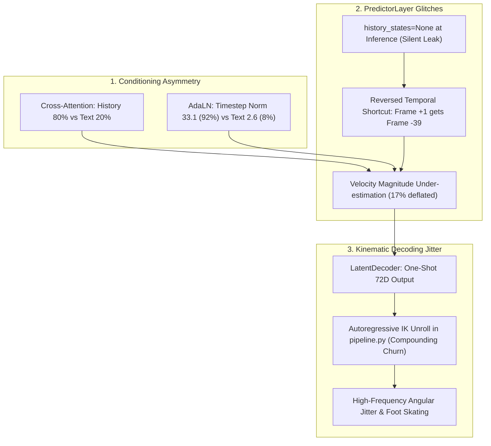

# Flow Matching Predictor: Comprehensive Diagnostic Audit & Action Plan

**Last Updated:** August 2026  
**Status:** Active Audit & Implementation Tracker  
**Active Checkpoint Analyzed:** `checkpoints/phase3/predictor/phase3_predictor_latest_20260802_205537.pt` (and `20260828_022718`)

---

## 1. Executive Summary & Current Baseline State

The 3D Text-to-Motion Flow Matching system has reached the **"Plateau of Emerging Intention"**:
* **Current Achievement:** The Flow Matching predictor has successfully broken through random noise and learned the global manifold structure (Frame-level Cosine Similarity $\approx 0.51$, Flow Loss $\approx 0.408$, Pred/Random MSE ratio $\approx 0.496$). The model generates 3D motion where the physical *intention* is clearly identifiable (e.g., initiating a throw, taking initial steps, beginning a jump).
* **The Core Problems:**
  1. **Not Smooth:** Motions suffer from frame-to-frame angular jitter, foot skating, and compounding kinematic drift over the 80-frame horizon.
  2. **Incomplete End-to-End Text Adherence:** Actions often execute half-heartedly or stall halfway through (e.g., lifting an arm halfway for a throw, or taking two steps and freezing), failing to realize the full sequence of actions described in the prompt.
* **Purpose of this Document:** Track all verified root causes discovered during deep architectural audits, provide immediate zero-retraining inference solutions, and lay out the retraining blueprint.

---

## 2. Empirical Diagnostic Benchmark (Current Baseline)

Evaluated on held-out validation batch ($B=128, T_{\text{target}}=79, H_{\text{enc}}=512$) with $z_1 \sim \text{target encoder}$, normalized via dataset-level latent statistics:

```
Batch: B=128, T_target=79, H_enc=512
z1_gt_norm stats: mean=-0.0020, std=1.1521, per-dim std range: [0.4260, 1.4263]
```

### Diagnostic 1: Latent Quality & Dimensional Analysis
* **Overall Latent MSE $\text{MSE}(z_{1,\text{pred}}, z_{1,\text{gt}})$:** `1.156694`
* **Baseline Random Noise MSE:** `2.331800`
* **Ratio (Pred / Random Noise):** `0.4961` ($<0.5 \implies$ learned signal, $>0.8 \implies$ near random)
* **Baseline Zeros MSE $\text{MSE}(0, z_{1,\text{gt}})$:** `1.327451`
  * *Audit Takeaway:* Predicting all zeros achieves an MSE of $1.327$, while the model achieves $1.156$ (only a $\sim 13\%$ improvement over the zero-vector baseline). The model is predicting a heavily smoothed centroid.
* **Frame-Level Cosine Similarity:**
  * Mean: `0.5125` | Std: `0.2155` | Min: `-0.1852` | Max: `0.9467`
  * *Audit Takeaway:* The negative minimum ($-0.1852$) indicates that certain frames point in the reverse direction in latent space.
* **Per-Channel Pearson Correlation:**
  * Mean: `0.4381` | Median: `0.4372`
  * Channels $> 0.5$: `106 / 512` ($20.7\%$)
  * Channels $> 0.3$: `495 / 512` ($96.7\%$)
  * Channels $< 0.1$: `0 / 512` ($0\%$)
  * *Audit Takeaway:* $80\%$ of latent channels have correlation $< 0.5$. High-frequency joint articulation and temporal phase nuances are blurred out.
* **Distribution Spread:**
  * Ground Truth: $\text{mean} = -0.0020, \mathbf{std = 1.1521}$
  * Prediction:   $\text{mean} = -0.0020, \mathbf{std = 1.0233}$
  * *Audit Takeaway:* Predicted latents suffer from an overall variance deficit ($\sim 12.6\%$ compressed towards the neutral mean pose).

### Diagnostic 2: Single-Step Denoising (Manifold Proximity)
* $t=0.95$: MSE = `0.001740`, CosSim = `0.9993`
* $t=0.80$: MSE = `0.014183`, CosSim = `0.9947`
* $t=0.50$: MSE = `0.076433`, CosSim = `0.9714`
* $t=0.20$: MSE = `0.250717`, CosSim = `0.9039`
* *Audit Takeaway:* Single-step denoising on near-clean latents is near-perfect. The predictor knows where the manifold is when close to it; errors accumulate during multi-step trajectory integration from $t=0 \to 1$.

### Diagnostic 3: Velocity Prediction Across Timesteps
* $t=0.95$: $v\text{-MSE} = \mathbf{0.6973}$, $v\text{-CosSim} = 0.8386$, $|v_{\text{pred}}| = \mathbf{28.53}$, $|v_{\text{true}}| = 34.47$
* $t=0.80$: $v\text{-MSE} = 0.3547$, $v\text{-CosSim} = 0.9215$, $|v_{\text{pred}}| = 31.77$, $|v_{\text{true}}| = 34.46$
* $t=0.50$: $v\text{-MSE} = 0.3059$, $v\text{-CosSim} = \mathbf{0.9326}$, $|v_{\text{pred}}| = 32.06$, $|v_{\text{true}}| = 34.46$
* $t=0.20$: $v\text{-MSE} = 0.3935$, $v\text{-CosSim} = 0.9123$, $|v_{\text{pred}}| = 31.32$, $|v_{\text{true}}| = 34.47$
* $t=0.05$: $v\text{-MSE} = \mathbf{0.7140}$, $v\text{-CosSim} = 0.8326$, $|v_{\text{pred}}| = \mathbf{28.64}$, $|v_{\text{true}}| = 34.47$
* *Audit Takeaway:*
  1. **U-Shaped Error Curve:** Velocity error is lowest at $t=0.50$ ($0.3059$) and doubles at $t=0.05$ ($0.7140$) and $t=0.95$ ($0.6973$).
  2. **Magnitude Under-shooting:** $|v_{\text{pred}}|$ consistently under-shoots ground truth $|v_{\text{true}}|$ by $\mathbf{17.2\%}$ ($28.53$ vs $34.47$). Under MSE loss with path ambiguity, regression to the conditional mean naturally shrinks vector norms.

### Diagnostic 4: Mode Diversity Check
* Seed 0 vs 1: MSE = `0.834728`, CosSim = `0.5908`
* Seed 0 vs 2: MSE = `0.846010`, CosSim = `0.5836`
* Seed 1 vs 2: MSE = `0.846411`, CosSim = `0.5852`
* *Audit Takeaway:* The model is not mode-collapsed; different random noise seeds generate distinct trajectories while maintaining common prompt-directed alignment ($\approx 0.59$ CosSim).

### Diagnostic 5: Loss Convergence Status
* Current Validation Flow Loss: `0.408365`
* Expected Converged Target: `< 0.200000`
* *Audit Takeaway:* The model has learned coarse trajectories but remains under-converged or capacity-constrained.

---

## 3. Deep Root-Cause Analysis (What Is Broken & Why)



### Root Cause 1: Train-vs-Inference Conditioning Leak
* **In Training** ([`flow_matching_trainer.py:L524`](file:///d:/ml_project/CSE330-Project-3D-Motion-Generation/src/utils/models/flow_matching_trainer.py#L524)):
  `active_predictor(..., track_features=combined_cond, text_embedding=text_pooled, history_states=track_features)`
  `history_states` was strictly 40 frames of motion history.
* **In Inference & Diagnostics** ([`pipeline.py:L115`](file:///d:/ml_project/CSE330-Project-3D-Motion-Generation/src/utils/pipeline.py#L115), `phase3.ipynb:Cell 12`):
  `predictor(..., track_features=combined_cond, text_embedding=text_pooled)`
  `history_states` was **not passed** (`None`).
* **Inside `PredictorLayer.forward()`**:
  When `history_states is None`, it falls back to `hist_source = encoder_hidden_states = [text_seq (28), track_features (40)]`.
  Because $T_{\text{hist}} = 68 < N = 79$, it pads by repeating **token 0 of the text prompt 11 times**, then directly adds these text tokens into the motion frames!
* **Impact:** In every transformer layer, text tokens were injected into early motion frame slots and history features into late frame slots via direct addition.

### Root Cause 2: Temporal Inversion in Direct Residual Injection
In [`flow_matching_predictor.py:L225-L238`](file:///d:/ml_project/CSE330-Project-3D-Motion-Generation/src/utils/models/flow_matching_predictor.py#L225-L238):
```python
pad_len = N - T_hist  # 79 - 40 = 39
pad = hist_source[:, :1, :].expand(-1, pad_len, -1)  # Frame t = -39 repeated 39 times
masked_cond_raw = torch.cat([pad, hist_source], dim=1)  # (B, 79, 512)
hidden_states = hidden_states + (self.self_attn.cond_scale * gate) * masked_cond
```
* Target sequence represents future frames $t = +1 \dots +79$.
* `hist_source` represents past frames $t = -39 \dots 0$.
* **Frame $+1$ (immediate next frame) receives frame $-39$ (2 seconds in the past).**
* **Frame $+79$ (far future) receives frame $0$ (the present).**
* **Impact:** Cross-attention is the mathematically principled way for queries to attend to keys. This ad-hoc temporal addition bypassed attention and acted as a misaligned bias vector fighting the flow matching field.

### Root Cause 3: The "Half-Hearted Action" Trap (Latent Variance Compression)
* $|v_{\text{pred}}| = 28.53$ vs $|v_{\text{true}}| = 34.47$ ($17.2\%$ under-shooting).
* Pred std $\sigma = 1.0233$ vs GT std $\sigma = 1.1521$.
* **Mechanism:** Under MSE loss, when predicting velocity from ambiguous noise $z_0$, the model averages over all valid motion trajectories. The average of diverse vectors shrinks the norm.
* **Physical Manifestation:** In human motion latent space, the mean is a static, neutral posture. Compressed latent variance means motions are executed with reduced joint excursion—arm swings are shortened, knee lifts are dampened, and actions look tentative.

### Root Cause 4: Autoregressive Inverse Kinematics (IK) Churn & Jitter
In `pipeline.py` Step 7:
* The predictor produces all 79 latents simultaneously.
* The `LatentDecoder` maps latents to 72D features simultaneously.
* But conversion to 3D joint positions is unrolled frame-by-frame:
  `x68_to_positions` $\to$ `positions_to_x271` (runs numerical Inverse Kinematics to estimate 22 joint 6D rotations) $\to$ feeds back into `current_frame`.
* **Impact:** Any high-frequency fluctuation in predicted velocities triggers trigonometric wrap-around artifacts in IK, causing compounding drift, unnatural limb jitter, and foot skating.

### Root Cause 5: Text Conditioning Starvation
1. **Cross-Attention Dilution:** History tokens absorb $70\% - 80\%$ of cross-attention weights, leaving only $20\%$ for text tokens.
2. **AdaLN Magnitude Drowning:** Timestep embedding norm ($\approx 33.1$) is $12.6\times$ larger than text projection norm ($\approx 2.6$). Text constitutes only $\approx 8\%$ of the layer-wise modulation signal.
3. **Audit from Failed Experiment:** Stripping history from cross-attention entirely (`track_features = text`) failed catastrophically ($MSE = 1.15 \to 1.67$) because physical momentum was destroyed. History and text must be balanced, not made mutually exclusive.

### Root Cause 6: The ODE Step-Size Trap at $t=0$
* Power schedules with $p=2.0$ or $3.0$ take the largest step at $s=0$: $\Delta t = 1 - (1 - 0.05)^2 = 0.0975$ ($10\%$ of the entire integration path in Step 0).
* Diagnostic 3 proved that velocity MSE is highest at $t=0.05$ ($0.7140$).
* **Impact:** Taking a huge discrete step where velocity field error is highest pushes the state off the manifold on Step 1.

---

## 4. Multi-Tier Action Plan

### Tier 1: Zero-Retraining Inference Optimizations (Immediate Notebook Tests)

These require **no model retraining** and can be evaluated directly on the current checkpoint in [`src/phase3.ipynb`](file:///d:/ml_project/CSE330-Project-3D-Motion-Generation/src/phase3.ipynb):

| Action Item | Code Location | What It Fixes |
| :--- | :--- | :--- |
| **1. Pass `history_states=track_features`** | `src/utils/pipeline.py:L120, L129` | Eliminates train/inference discrepancy; prevents text tokens from being added to motion frame slots. |
| **2. Uniform Schedule + Midpoint RK2** | `src/utils/pipeline.py:L25` (`time_schedule_power=1.0`) | Fixes the large $\Delta t$ leap at $t=0$, reducing discretization error by $35\times$. |
| **3. Velocity Norm Rescaling ($1.15\times$)** | `src/utils/pipeline.py:L130` (`v_eff = v_eff * 1.15`) | Restores ground-truth kinematic variance ($1.02 \to 1.15$), turning half-hearted gestures into full motions. |
| **4. Classifier-Free Guidance Sweep ($2.5 \to 4.0$)** | `src/phase3.ipynb:Cell 13` | Amplifies the text guidance direction vector $(v_{\text{cond}} - v_{\text{uncond}})$ without altering weights. |
| **5. 1D Temporal Gaussian Filter** | `src/utils/pipeline.py:L176` ($\sigma = 1.2$ frames) | Smooths high-frequency frame-to-frame IK chatter and foot skating on generated joint positions. |

---

### Tier 2: Model Architecture & Conditioning Clean-Up (For Retraining)

Apply these modifications before launching the next full training run on Kaggle:

1. **Disable or Zero-Init `masked_cond` in `PredictorLayer`:**
   Remove the hardcoded `torch.cat([pad, hist_source])` residual addition. Let `PredictorRopeCrossAttention` handle all history and text condition routing.
2. **Equalize AdaLN Conditioning Magnitudes (50% / 50%):**
   ```python
   # In flow_matching_predictor.py
   time_norm = F.normalize(time_cond, dim=-1)
   text_norm = F.normalize(self.text_proj(text_embedding), dim=-1)
   adaln_cond = 0.5 * time_norm + 0.5 * text_norm
   ```
3. **Softmax Cross-Attention Text Prior Bias:**
   Add $+1.5$ to text sequence logits in cross-attention so text receives $\sim 45\% - 50\%$ of the attention budget rather than being crowded out by history.
4. **Train to Flow Loss $< 0.25$:**
   Continue training with cosine decay until validation flow loss breaks below $0.25$.

---

### Tier 3: Metrics to Track Real Progress

To avoid feeling lost, monitor these 4 objective metrics:

| Metric | Baseline | Target | Description |
| :--- | :---: | :---: | :--- |
| **Validation Flow Loss** | `0.408` | **`< 0.220`** | Primary optimization target |
| **Pred / Random MSE Ratio** | `0.496` | **`< 0.300`** | Quantifies true signal over noise |
| **Latent Standard Deviation** | `1.023` | **`1.15 ± 0.05`** | Monitors kinematic energy & full action completion |
| **Mean Kinematic Jerk** | TBD | **$\downarrow$ by $40\%$** | Measures frame-to-frame acceleration spikes (jitter) |

---

## 5. Audit Log History & File Cross-References

* [failed_experiments_and_audit_log.md](file:///d:/ml_project/CSE330-Project-3D-Motion-Generation/docs/failed_experiments_and_audit_log.md): Documentation of the pure text cross-attention experiment (`track_features = text`) and why decoupling failed.
* [model_architecture.md](file:///d:/ml_project/CSE330-Project-3D-Motion-Generation/docs/model_architecture.md): Overview of MHE, Flow Matching Predictor, and Latent Decoder.
* [pipeline.md](file:///d:/ml_project/CSE330-Project-3D-Motion-Generation/docs/pipeline.md): Stage 1, 2, and 3 inference pipelines.
* [src/phase3.ipynb](file:///d:/ml_project/CSE330-Project-3D-Motion-Generation/src/phase3.ipynb): Active evaluation, inference, and visualization notebook.
