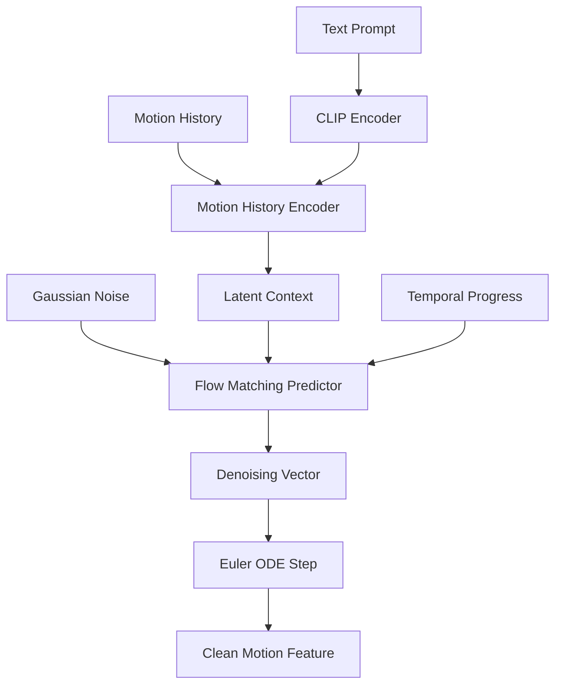

# High-Level Architecture Design: Human Motion Generation

This project focuses on generating high-quality 3D human motion sequences from textual descriptions. The architecture is a two-stage pipeline that combines sequential modeling with continuous flow matching.

## 1. Conceptual Workflow

The generation process follows a "Conditioned Denoising" paradigm:
1.  **Context Construction**: Past motion history and text prompts are encoded into a rich latent representation.
2.  **Denoising Prediction**: A spatial transformer predicts the denoising trajectory required to refine sample from pure Gaussian noise toward the realistic data manifold.
3.  **Iterative Refinement**: This prediction is repeated over several steps to reconstruct a clean motion frame.

---

## 2. Key Components

### A. Motion History Encoder (The "Context" Brain)
Responsible for understanding *what* should happen next based on:
-   **Text Prompts**: Handled via CLIP embeddings to capture semantic meaning.
-   **Temporal History**: Uses a **GRU-based** sequential model to summarize past movements.
-   **Joint-Specific Conditioning**: Projects the global context back to individual joints, ensuring the generating engine knows the specific state of each limb.

### B. Flow Matching Predictor (The "Generation" Engine)
The core "artist" of the model. It defines a vector field in joint space.
-   **Spatial Transformer**: Unlike the sequential encoder, this uses a **Transformer Encoder** to attend to all 22 joints simultaneously.
-   **Kinematic Bias**: Incorporates knowledge of human skeleton hierarchy (which joint is connected to which) to ensure anatomical plausibility.
-   **Output**: Predicts the denoising vector (flow velocity) used to iteratively generate clean motion from pure Gaussian noise.

### C. Human Motion Generator (The "Pipeline" Wrapper)
Integrates the Encoder and Predictor into a single interface.
-   **CFG (Classifier-Free Guidance)**: Interpolates between conditioned (text+history) and unconditioned (history only) flows to improve adherence to the text prompt.
-   **Inference Loop**: Implements an Euler-based ODE solver to generate motion through iterative refinement.

---

## 3. Data Flow Diagram

## 4. Why This Architecture?
-   **Flow Matching**: Offers more stable training than GANs and faster inference than some diffusion models.
-   **Dual-Stage**: Separates the complex task of "understanding intent" (Encoder) from "drawing pixels/joints" (Predictor).
-   **MoMask Compatibility**: Built to work with standard HumanML3D datasets and BVH visualization tools.
