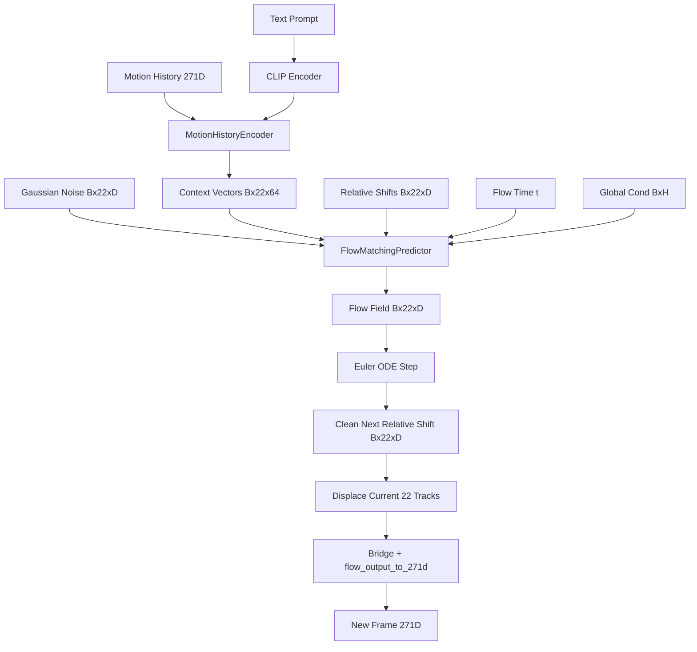
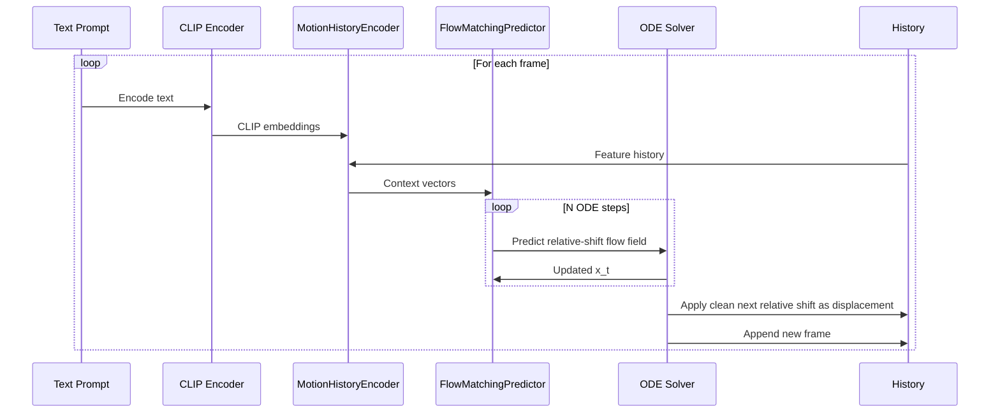

# High-Level Architecture Design: Human Motion Generation

This project focuses on generating high-quality 3D human motion sequences from textual descriptions. The architecture is a two-stage pipeline that combines spatiotemporal transformer encoding with continuous flow matching.

## 1. Conceptual Workflow

The generation process follows a "Conditioned Denoising" paradigm:
1. **Context Construction**: Past motion history and text prompts are encoded into a rich latent representation using a spatiotemporal transformer.
2. **Relative-Shift Flow Prediction**: A spatial transformer predicts the flow field of the clean next relative shift in joint-track space.
3. **Iterative Refinement**: The predicted flow is integrated over ODE steps to obtain a clean next relative shift, then applied as displacement on the current 22 track positions.

---

## 2. Model Architecture

### A. Motion History Encoder (GRU-based Context Encoder)

The encoder uses a **GRU (Gated Recurrent Unit)** architecture to process motion history and text conditioning.

#### Forward Pass Data Pipeline

```
Input: motion_seq(B, T, 271), text_emb(B, 512)
                    │
                    ▼
┌─────────────────────────────────────────────────────────────┐
│  1. TEXT PROJECTION                                         │
│     text_proj = Linear(text_emb)           # (B, text_proj_dim)│
│     t_scaled = text_scale * text_proj       # Apply text scale │
│     t_rep = t_scaled.unsqueeze(1).expand(B, T, -1)  # (B,T,D)│
└─────────────────────────────────────────────────────────────┘
                    │
                    ▼
┌─────────────────────────────────────────────────────────────┐
│  2. INITIALIZE GRU HIDDEN STATE                             │
│     h0 = text_to_hidden(text_emb)       # (B, hidden_dim)  │
│     h0 = h0.unsqueeze(0).repeat(num_layers, 1, 1)  # (L,B,H)│
└─────────────────────────────────────────────────────────────┘
                    │
                    ▼
┌─────────────────────────────────────────────────────────────┐
│  3. CONCATENATE MOTION + TEXT                               │
│     gru_input = cat([motion_seq, t_rep], dim=-1)           │
│                                     # (B, T, motion_dim + text_proj_dim)│
└─────────────────────────────────────────────────────────────┘
                    │
                    ▼
┌─────────────────────────────────────────────────────────────┐
│  4. GRU FORWARD PASS                                        │
│     h_seq, h_next = gru(gru_input, h0)  # h_seq: (B,T,H) │
│     h_last = h_seq[:, -1, :]             # Last timestep  │
│                                     # (B, hidden_dim)     │
└─────────────────────────────────────────────────────────────┘
                    │
                    ▼
┌─────────────────────────────────────────────────────────────┐
│  5. MLP TO PER-JOINT TOKENS                                 │
│     joint_tokens = global_to_joints(h_last)                 │
│                                     # (B, 22 * per_joint_dim)│
│     history_features = joint_tokens.view(B, 22, per_joint_dim)│
│                                     # (B, 22, per_joint_dim)│
└─────────────────────────────────────────────────────────────┘

Output: history_features(B, 22, per_joint_dim)
```

#### Step Function (for AR inference)

For autoregressive generation, the encoder provides a `step()` method:

```
Input: x_t(B, 271), text_emb(B, 512), h(Optional[L, B, H])
                    │
                    ▼
┌─────────────────────────────────────────────────────────────┐
│  1. PREPARE SINGLE TIMESTEP INPUT                          │
│     motion_in = x_t.unsqueeze(1)         # (B, 1, 271)    │
└─────────────────────────────────────────────────────────────┘
                    │
                    ▼
┌─────────────────────────────────────────────────────────────┐
│  2. RUN GRU BLOCK (same as forward pass)                   │
│     history_features, h_next = _gru_block(motion_in, text_emb, h)│
└─────────────────────────────────────────────────────────────┘

Output: history_features(B, 22, per_joint_dim), h_next(L, B, H)
```

---

### B. Flow Matching Predictor (Spatial Transformer)

The core generation engine that predicts velocity fields in track space for the next relative shift.

#### Forward Pass Data Pipeline

```
Input: noised_tracks(B,22,D), timesteps(B,),
             global_cond(B,H), track_features(B,22,F),
             relative_shifts(B,22,D optional)
                    │
                    ▼
┌─────────────────────────────────────────────────────────────┐
│  1. FEATURE CONCATENATION                                   │
│     x_in = cat([noised_tracks, track_features,              │
│                 relative_shifts if enabled], dim=-1)        │
│                                    # (B,22,input_dim)       │
└─────────────────────────────────────────────────────────────┘
                    │
                    ▼
┌─────────────────────────────────────────────────────────────┐
│  2. INPUT PROJECTION                                        │
│     hidden = Linear(input_dim -> hidden_size)(x_in)         │
│                                    # (B,22,H)               │
└─────────────────────────────────────────────────────────────┘
                    │
                    ▼
┌─────────────────────────────────────────────────────────────┐
│  3. TIME + GLOBAL CONDITIONING                              │
│     t_emb = SinusoidalEmbedder(timesteps)   # (B,H)         │
│     adaln_cond = t_emb + global_cond        # (B,H)         │
└─────────────────────────────────────────────────────────────┘
                    │
                    ▼
┌─────────────────────────────────────────────────────────────┐
│  4. SPATIAL TRACK TRANSFORMER STACK                         │
│     Repeat N layers:                                         │
│       - LayerNorm + AdaLN modulation                         │
│       - MultiheadAttention over 22 tracks (no masking)       │
│       - gated residual                                        │
│       - LayerNorm + AdaLN + gated MLP residual               │
│     hidden = SpatialTrackLayers(hidden, adaln_cond)          │
└─────────────────────────────────────────────────────────────┘
                    │
                    ▼
┌─────────────────────────────────────────────────────────────┐
│  5. OUTPUT PROJECTION                                       │
│     hidden = LayerNorm(hidden)                              │
│     (shift, scale) = AdaLN(adaln_cond).chunk(2)             │
│     hidden = hidden * (1 + scale) + shift                   │
│     flow = Linear(H -> D)(hidden)                           │
│                                    # (B,22,D)               │
└─────────────────────────────────────────────────────────────┘

Output: flow(B,22,D) - predicted flow field in track space

#### Prediction Goal

For each frame, the model predicts the flow field of the clean next relative shift in 22-track space.

```
Given: current tracks P_curr in R^(B x 22 x D)
Initialize: x_t ~ N(0, I) in R^(B x 22 x D)

ODE integration:
    x_t <- x_t + f_theta(x_t, t, context) * dt

After N steps:
    Delta_rel_next_clean = x_t

Displacement update:
    P_next = P_curr + Delta_rel_next_clean
```
```

---

### C. Human Motion Generator (Pipeline Wrapper)

Integrates the Encoder and Predictor into a single interface for autoregressive generation.

#### Generation Loop Data Pipeline

```
Input: text, num_frames, num_steps, guidance_scale, input_features
                    │
                    ▼
┌─────────────────────────────────────────────────────────────┐
│  1. TEXT ENCODING                                           │
│     if text is str: text = clip_encoder(text) # (1,1,512)   │
│     elif text is list: text = clip_encoder(text)            │
│     B = text.shape[0]                                       │
└─────────────────────────────────────────────────────────────┘
                    │
                    ▼
┌─────────────────────────────────────────────────────────────┐
│  2. HISTORY INITIALIZATION                                  │
│     if input_features is None:                              │
│         root_pos = zeros(B, 3)                              │
│         root_tracker = RootPositionTracker(root_pos)        │
│         feature_history = null_history.expand(B, 1, 271)    │
│     else:                                                   │
│         feature_history = input_features.clone()            │
│         root_tracker = RootPositionTracker.from_history(...)│
└─────────────────────────────────────────────────────────────┘
                    │
                    ▼
┌─────────────────────────────────────────────────────────────┐
│  FOR frame_idx in range(num_frames):                        │
│  ┌───────────────────────────────────────────────────────┐  │
│  │  3a. EXTRACT LAST FRAME                               │  │
│  │      last_frame = feature_history[:, -1]  # (B, 271)  │  │
│  │      prev_root_pos = root_tracker.get()   # (B, 3)    │  │
│  └───────────────────────────────────────────────────────┘  │
│                    │                                        │
│                    ▼                                        │
│  ┌───────────────────────────────────────────────────────┐  │
│  │  3b. ENCODE CONTEXT                                   │  │
│  │      context = encoder(encoder_input, text_emb)       │  │
│  │                         # (B, 22, per_joint_dim)      │  │
│  └───────────────────────────────────────────────────────┘  │
│                    │                                        │
│                    ▼                                        │
│  ┌───────────────────────────────────────────────────────┐  │
│  │  3c. TRACK-SPACE ODE INITIALIZATION                   │  │
│  │      x_t = randn(B, 22, D)                            │  │
│  │      dt = 1.0 / num_steps                             │  │
│  └───────────────────────────────────────────────────────┘  │
│                    │                                        │
│                    ▼                                        │
│  ┌───────────────────────────────────────────────────────┐  │
│  │  3d. FLOW MATCHING ODE LOOP                           │  │
│  │      for step in range(num_steps):                    │  │
│  │          t = full((B,), step * dt)                    │  │
│  │          rel = x_t - x_t[:, :1, :]                    │  │
│  │          g = zeros(B, H)                              │  │
│  │          pred = predictor(x_t, t, g, context, rel)[0] │  │
│  │          x_t = x_t + pred * dt                        │  │
│  └───────────────────────────────────────────────────────┘  │
│                    │                                        │
│                    ▼                                        │
│  ┌───────────────────────────────────────────────────────┐  │
│  │  3e. INTERPRET ODE RESULT                             │  │
│  │      clean_next_relative_shift = x_t                  │  │
│  │      next_track_positions = current_positions         │  │
│  │                             + clean_next_relative_shift│  │
│  └───────────────────────────────────────────────────────┘  │
│                    │                                        │
│                    ▼                                        │
│  ┌───────────────────────────────────────────────────────┐  │
│  │  3f. CONVERT TO 271D FEATURE FRAME                     │  │
│  │      Pack/convert and call flow_output_to_271d(...)    │  │
│  │      to produce new_frame (B,271) and new_root_pos(B,3)│  │
│  └───────────────────────────────────────────────────────┘  │
│                    │                                        │
│                    ▼                                        │
│  ┌───────────────────────────────────────────────────────┐  │
│  │  3g. UPDATE HISTORY                                   │  │
│  │      root_tracker.update(new_frame)                   │  │
│  │      feature_history = cat([feature_history,          │  │
│  │                          new_frame.unsqueeze(1)], dim=1)│  │
│  │                      # (B, N+1, 271)                  │  │
│  └───────────────────────────────────────────────────────┘  │
│  END FOR                                                    │
└─────────────────────────────────────────────────────────────┘
                    │
                    ▼
┌─────────────────────────────────────────────────────────────┐
│  4. CONVERT TO POSITIONS                                    │
│     position_history = features_to_positions(feature_history)│
│                                    # (B, N+num_frames, 22, 3)│
└─────────────────────────────────────────────────────────────┘

Output: position_history(B, N+num_frames, 22, 3)
```

---

## 3. Data Representation

### 271D Feature Format (HumanML3D Custom)

| Index Range | Feature Type     | Description                            |
| :---------- | :--------------- | :------------------------------------- |
| `[0:3]`     | Root Global      | Height Y, Velocity X, Velocity Z       |
| `[3:69]`    | RIC Positions    | 22 joints × 3D relative positions      |
| `[69:201]`  | 6D Rotations     | 22 joints × 6D rotation representation |
| `[201:267]` | Local Velocities | 22 joints × 3D velocities              |
| `[267:271]` | Foot Contacts    | 4 binary contact flags                 |

### Flow Matching Target (72D, Legacy Bridge Format)

| Index Range | Feature Type  | Description                              |
| :---------- | :------------ | :--------------------------------------- |
| `[0:9]`     | Root Features | Height(1) + Velocity(2) + Rotation_6d(6) |
| `[9:72]`    | Joint RIC     | 21 joints × 3D RIC positions             |

### Track-Space Flow State (Current Predictor Interface)

| Tensor            | Shape        | Description                                                   |
| :---------------- | :----------- | :------------------------------------------------------------ |
| `noised_tracks`   | `(B, 22, D)` | Current noisy track-space state used in ODE integration       |
| `track_features`  | `(B, 22, F)` | Per-track conditional context from MotionHistoryEncoder       |
| `relative_shifts` | `(B, 22, D)` | Relative offsets, typically computed as `x_t - x_t[:, :1, :]` |
| `flow_prediction` | `(B, 22, D)` | Predicted flow field for clean next relative shift            |

### Previous Frame Features (261D, Legacy Representation)

| Index Range | Feature Type   | Description                              |
| :---------- | :------------- | :--------------------------------------- |
| `[0:9]`     | Root Features  | Height(1) + Velocity(2) + Rotation_6d(6) |
| `[9:261]`   | Joint Features | 21 joints × 12D (RIC + Rot + Vel)        |

---

## 4. Training Configuration

| Parameter               | Value | Description                                      |
| :---------------------- | :---- | :----------------------------------------------- |
| `encoder_hidden_dim`    | 256   | GRU hidden dimension                             |
| `encoder_num_layers`    | 2     | MotionHistoryEncoder GRU layers                  |
| `encoder_per_joint_dim` | 64    | Per-joint context vector dimension               |
| `predictor_model_dim`   | 128   | FlowMatchingPredictor hidden dimension           |
| `predictor_num_layers`  | 2     | FlowMatchingPredictor spatial transformer layers |
| `batch_size`            | 192   | Training batch size                              |
| `learning_rate`         | 1e-4  | Adam learning rate                               |
| `num_epochs`            | 1000  | Total training epochs                            |
| `dropout`               | 0.1   | Dropout rate                                     |
| `ema_decay`             | 0.999 | EMA decay for validation                         |
| `cfg_dropout`           | 0.1   | CFG dropout probability                          |

### Progressive Horizon Curriculum

Training uses progressive context windows:
- Stage 1: 16 frames
- Stage 2: 32 frames
- Stage 3: 64 frames
- Stage 4: 128 frames (optional)

---

## 5. Data Flow Diagram


```mermaid
graph TD
    Text[Text Prompt] --> CLIP[CLIP Encoder]
    History[Motion History 271D] --> Encoder[MotionHistoryEncoder]
    CLIP --> Encoder
    Encoder --> Context[Context Vectors Bx22x64]
    
    Noise[Gaussian Noise Bx22xD] --> Predictor[FlowMatchingPredictor]
    Context --> Predictor
    Rel[Relative Shifts Bx22xD] --> Predictor
    Time[Flow Time t] --> Predictor
    Global[Global Cond BxH] --> Predictor
    
    Predictor --> Flow[Flow Field Bx22xD]
    Flow --> Euler[Euler ODE Step]
    Euler --> CleanShift[Clean Next Relative Shift Bx22xD]
    CleanShift --> Displace[Displace Current 22 Tracks]
    Displace --> Convert[Bridge + flow_output_to_271d]
    Convert --> NewFrame[New Frame 271D]
```

---

## 6. Inference Pipeline


```mermaid
sequenceDiagram
    participant Text as Text Prompt
    participant CLIP as CLIP Encoder
    participant MHE as MotionHistoryEncoder
    participant FMP as FlowMatchingPredictor
    participant ODE as ODE Solver
    
    loop For each frame
        Text->>CLIP: Encode text
        CLIP->>MHE: CLIP embeddings
        History->>MHE: Feature history
        MHE->>FMP: Context vectors
        loop N ODE steps
            FMP->>ODE: Predict relative-shift flow field
            ODE->>FMP: Updated x_t
        end
        ODE->>History: Apply clean next relative shift as displacement
        ODE->>History: Append new frame
    end
```

---

## 7. Key Implementation Details

### Tensor Shape Transformations Summary

| Stage              | Operation                  | Input Shape                            | Output Shape                     |
| :----------------- | :------------------------- | :------------------------------------- | :------------------------------- |
| Text Projection    | Linear + Expand            | `(B, L_text, 512)`                     | `(B, L_text, 22, D)`             |
| Global Token       | Extract + Linear           | `(B, T, 271)`                          | `(B, T, 1, D)`                   |
| Track Tokens       | Extract + View + Linear    | `(B, T, 271)`                          | `(B, T, 21, D)`                  |
| Motion Assembly    | Concat                     | `(B, T, 1, D)` + `(B, T, 21, D)`       | `(B, T, 22, D)`                  |
| Sequence Concat    | Concat                     | `(B, L_text, 22, D)` + `(B, T, 22, D)` | `(B, L_text+T, 22, D)`           |
| Spatial Attention  | Reshape + Attn             | `(B, T, 22, D)`                        | `(B*T, 22, D)` → `(B, T, 22, D)` |
| Temporal Attention | Transpose + Reshape + Attn | `(B, T, 22, D)`                        | `(B*22, T, D)` → `(B, T, 22, D)` |
| Output Extraction  | Slice                      | `(B, L_text+T, 22, D)`                 | `(B, T, 22, D)`                  |

### Addition Operations (Broadcasting)

| Operation            | Left Shape      | Right Shape     | Result Shape    |
| :------------------- | :-------------- | :-------------- | :-------------- |
| Kinematic Bias       | `(B, T, 22, D)` | `(1, 1, 22, D)` | `(B, T, 22, D)` |
| History + Prev       | `(B, 22, D)`    | `(B, 22, D)`    | `(B, 22, D)`    |
| Cond + Noisy         | `(B, 22, D)`    | `(B, 22, D)`    | `(B, 22, D)`    |
| Time Bias            | `(B, 22, D)`    | `(B, 1, D)`     | `(B, 22, D)`    |
| Kinematic Bias (FMP) | `(B, 22, D)`    | `(1, 22, D)`    | `(B, 22, D)`    |

---

## 8. Why This Architecture?

- **Flow Matching**: Offers stable training dynamics compared to GANs, with faster inference than diffusion models
- **Kinematic Chain Bias**: Ensures anatomically plausible motion by encoding skeletal hierarchy
- **Dual-Stage Design**: Separates context understanding (Encoder) from generation (Predictor)
- **HumanML3D Compatible**: Works with standard datasets and BVH visualization tools
