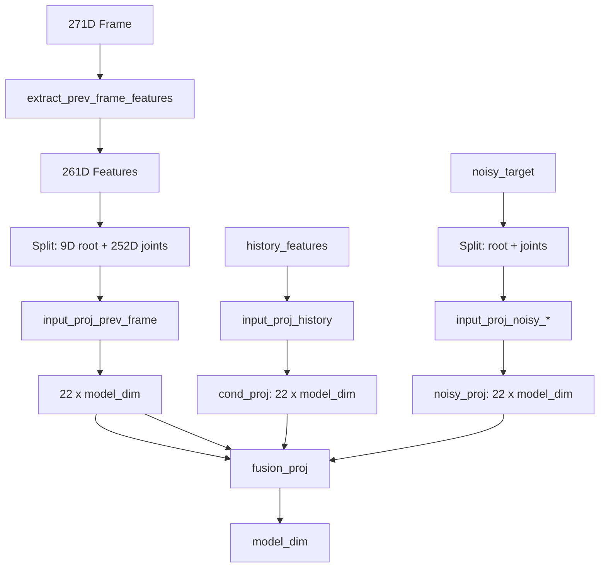

# Implementation Plan: Add prev_frame_features to FlowMatchingPredictor

## Overview

Add `prev_frame_features` input to `FlowMatchingPredictor` and handle it through `fusion_proj`, following the same pattern used for `cond_proj`. This requires updating:
1. FlowMatchingPredictor model
2. Training loop (train_utils.py)
3. Inference pipeline (models.py)

---

## Step 1: Create Helper Function in motion_utils.py

### File: `src/utils/motion_utils.py`

Add function to extract 261D features from previous frame:

```python
def extract_prev_frame_features(frame: torch.Tensor) -> torch.Tensor:
    """
    Extract 261D features from 271D previous frame.
    
    261D Output Format:
        [0:9]     Root: height(1) + vel(2) + rot_6d(6)
        [9:261]   Joints: 21 x 12D (RIC + rot + vel) = 252D
    
    Args:
        frame: (B, 271) single frame in RAW format
    
    Returns:
        features: (B, 261)
    """
    # Root features (9D)
    root_height = frame[:, 0:1]
    root_vel = frame[:, 1:3]
    root_rot6d = frame[:, 69:75]
    root_features = torch.cat([root_height, root_vel, root_rot6d], dim=-1)  # (B, 9)
    
    # Joint features: 21 joints x 12D each (RIC + rotation + velocity)
    # RIC: [6:69] = 63D
    # Rotations: [75:201] = 126D  
    # Velocities: [204:267] = 63D
    # Total per joint: 3 + 6 + 3 = 12D
    joint_ric = frame[:, 6:69]      # (B, 63)
    joint_rot = frame[:, 75:201]    # (B, 126)
    joint_vel = frame[:, 204:267]  # (B, 63)
    
    joint_features = torch.cat([joint_ric, joint_rot, joint_vel], dim=-1)  # (B, 252)
    
    return torch.cat([root_features, joint_features], dim=-1)  # (B, 261)
```

---

## Step 2: Update FlowMatchingPredictor in models.py

### File: `src/models.py`

#### 2.1 Update `__init__` method

Add projection layer for prev_frame_features and update fusion_proj:

```python
# Add new parameter
self.prev_frame_dim = 261  # 9D root + 252D joints

# Add projection for prev_frame_features (new)
self.input_proj_prev_frame = nn.Linear(self.prev_frame_dim, model_dim)

# Learnable bias for when prev_frame_features is None
self.null_prev_bias = nn.Parameter(torch.zeros(22, model_dim))

# Update fusion_proj to handle 3 inputs (cond + noisy + prev)
self.fusion_proj = nn.Linear(3 * model_dim, model_dim)
```

#### 2.2 Update `forward` method

Add prev_frame_features parameter and handle it through fusion:

```python
def forward(
    self,
    history_features: torch.Tensor,  # (B, 22, per_joint_dim)
    noise_level: torch.Tensor,  # (B,)
    noisy_target: Optional[torch.Tensor] = None,  # (B, 72)
    prev_frame_features: Optional[torch.Tensor] = None,  # NEW: (B, 261)
    temporal_progress: Optional[torch.Tensor] = None,
):
    # ... existing code ...
    
    # --- Project prev_frame_features (NEW) ---
    if prev_frame_features is None:
        # Use learned bias tensor when not provided (backwards compatible)
        prev_proj = self.null_prev_bias.unsqueeze(0).expand(B, -1, -1)  # (B, 22, model_dim)
    else:
        # Split into root and joints
        prev_root = prev_frame_features[:, :9]  # (B, 9)
        prev_joints = prev_frame_features[:, 9:].reshape(B, J - 1, -1)  # (B, 21, 12)
        
        # Project separately and concatenate
        prev_root_proj = self.input_proj_noisy_root(prev_root).unsqueeze(1)  # (B, 1, model_dim)
        prev_joints_proj = self.input_proj_prev_frame(prev_joints)  # (B, 21, model_dim)
        
        prev_proj = torch.cat([prev_root_proj, prev_joints_proj], dim=1)  # (B, 22, model_dim)
    
    # --- Combine condition + noisy + prev ---
    # Change from: torch.cat([cond_proj, noisy_proj], dim=-1)
    x = torch.cat([cond_proj, noisy_proj, prev_proj], dim=-1)  # (B, 22, 3*model_dim)
    x = self.fusion_proj(x)  # (B, 22, model_dim)
    
    # ... rest of forward pass ...
```

---

## Step 3: Update Training Loop in train_utils.py

### File: `src/utils/train_utils.py`

#### 3.1 Add import for extract_prev_frame_features

```python
from utils.motion_utils import (
    features_to_positions,
    flow_output_to_positions,
    flow_output_to_271d,
    RootPositionTracker,
    FeatureNormalizer,
    extract_prev_frame_features,  # NEW
)
```

#### 3.2 Update predictor call in training loop

Find the predictor call around line 433 and add prev_frame_features:

```python
# Extract prev_frame_features from previous frame
prev_features = extract_prev_frame_features(prev_flat)  # (B*N, 261)

# Predict velocity field
pred = predictor(
    history_features=contexts_flat,
    noise_level=t,
    noisy_target=x_t,
    prev_frame_features=prev_features,  # NEW
)
```

Note: `prev_flat` should be `targets_flat[:, :-1, :]` (all frames except the last target), extracted before creating the current batch.

---

## Step 4: Update Inference Pipeline in models.py

### File: `src/models.py`

#### 4.1 Add import for extract_prev_frame_features

In the HumanMotionGenerator class imports (around line 25-31):

```python
from utils.motion_utils import (
    features_to_positions,
    flow_output_to_positions,
    flow_output_to_271d,
    RootPositionTracker,
    FeatureNormalizer,
    extract_prev_frame_features,  # NEW
)
```

#### 4.2 Update predictor call in generate_sequence

Find the predictor call in the ODE loop (around line 881-885) and add prev_frame_features:

```python
# Extract prev_frame_features from last_frame (271D -> 261D)
prev_features = extract_prev_frame_features(last_frame)  # (B, 261)

# Flow matching ODE step
v_t = self.predictor(
    history_features=context_cond,
    noise_level=t,
    noisy_target=x_t,
    prev_frame_features=prev_features,  # NEW
)
```

---

## Implementation Order

1. **Create helper function** in `motion_utils.py` - `extract_prev_frame_features`
2. **Update FlowMatchingPredictor** in `models.py`:
   - Add `input_proj_prev_frame` in `__init__`
   - Update `fusion_proj` dimension from `2*model_dim` to `3*model_dim`
   - Add `prev_frame_features` parameter in `forward`
   - Handle projection and fusion
3. **Update training loop** in `train_utils.py`:
   - Add import
   - Extract prev features before predictor call
   - Pass to predictor
4. **Update inference pipeline** in `models.py`:
   - Add import
   - Extract prev features in generation loop
   - Pass to predictor

---

## Key Design Decisions

1. **Default behavior**: When `prev_frame_features` is None, use a learned bias tensor (backwards compatible)
2. **Projection pattern**: Same as noisy_target - split root/joints, project separately, concatenate
3. **Fusion**: Concatenate 3 projections (cond + noisy + prev) before fusion_proj

---

## Mermaid Diagram: Data Flow


