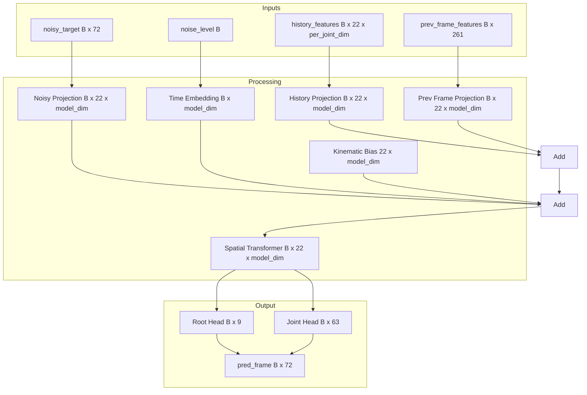
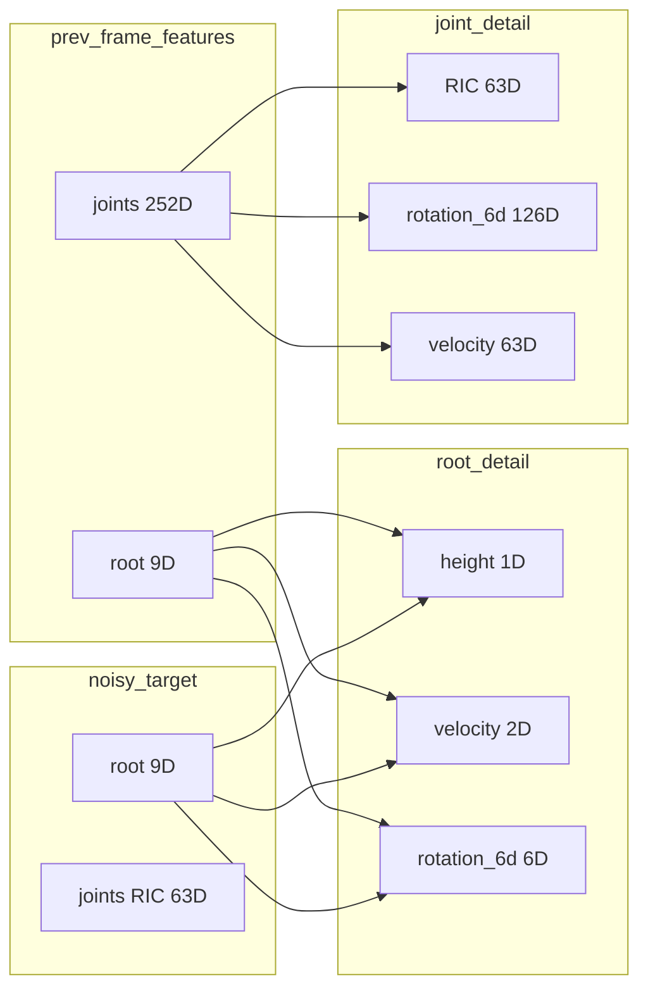

# FlowMatchingPredictor Refactoring Plan

## Overview

This plan addresses I/O scheme discrepancies in `FlowMatchingPredictor` and related components. The chosen design is **Option A**: Keep 261D `prev_frame_features` to match the current code implementation.

## Current State Analysis

### FlowMatchingPredictor I/O (Actual Implementation)

| Parameter | Shape | Description |
|-----------|-------|-------------|
| `history_features` | (B, 22, per_joint_dim) | Context from MotionHistoryEncoder |
| `noise_level` | (B,) | Flow time t in [0,1] |
| `noisy_target` | (B, 72) | Root (9D) + Joint RIC positions (63D) |
| `prev_frame_features` | (B, 261) | Root (9D) + Joint features (252D) |
| **Output** | (B, 72) | Root (9D) + Joint RIC positions (63D) |

### Feature Layout Details

**noisy_target (72D):**
- `[0:9]` Root features: height (1D) + velocity (2D) + rotation_6d (6D)
- `[9:72]` Joint RIC positions: 21 joints × 3D = 63D

**prev_frame_features (261D):**
- `[0:9]` Root features: height (1D) + velocity (2D) + rotation_6d (6D)
- `[9:261]` Joint features: 21 joints × 12D = 252D
  - Per joint: RIC position (3D) + rotation_6d (6D) + local_velocity (3D) = 12D

### Issues Found

1. **Docstring Mismatch**: `FlowMatchingPredictor` docstring says `prev_frame_features: (B, 72)` but code expects `(B, 261)`

2. **Test File Wrong Shapes**: 
   - Uses `noisy_target: (B, 22, 3)` instead of `(B, 72)`
   - Uses `prev_frame_features: (B, 22, 12)` instead of `(B, 261)`
   - Expects output `(B, 22, 3)` instead of `(B, 72)`

3. **HumanMotionGenerator.generate_sequence() Bug**:
   - Line 850: `x_t = torch.randn((B, 22, 3))` should be `(B, 72)`
   - Lines 845-847: Creates wrong `prev_frame_features` shape

4. **Documentation Outdated**: `docs/reference.md` needs updates

---

## Refactoring Tasks

### Task 1: Rewrite test_flow_predictor.py

**File:** `tests/test_flow_predictor.py`

**Changes:**
1. Fix input shapes to match actual implementation:
   - `noisy_target`: `(B, 72)` not `(B, 22, 3)`
   - `prev_frame_features`: `(B, 261)` not `(B, 22, 12)`
   
2. Fix expected output shape:
   - Output: `(B, 72)` not `(B, 22, 3)`

3. Add comprehensive tests:
   - Test with all inputs provided
   - Test zero-shot (no prev frame)
   - Test different batch sizes
   - Test with None noisy_target (random generation)
   - Test output value ranges

**New Test Structure:**
```python
def test_predictor_basic():
    # Test with all inputs
    noisy_target = torch.randn(B, 72)  # Fixed shape
    prev_frame_features = torch.randn(B, 261)  # Fixed shape
    output = predictor(...)
    assert output.shape == (B, 72)  # Fixed expected shape

def test_predictor_zero_shot():
    # Test without prev_frame_features
    output = predictor(..., prev_frame_features=None)
    assert output.shape == (B, 72)

def test_predictor_no_noisy_target():
    # Test with None noisy_target (random generation)
    output = predictor(..., noisy_target=None)
    assert output.shape == (B, 72)

def test_predictor_batch_sizes():
    # Test various batch sizes
    for B in [1, 4, 8, 16]:
        ...
```

### Task 2: Update docs/reference.md

**File:** `docs/reference.md`

**Changes:**
1. Update FlowMatchingPredictor section:
   ```
   FlowMatchingPredictor: (context:Bx22x64, t:B, x_t:Bx72, prev:Bx261, progress) -> v:Bx72
     noisy_target (72D): root(9) + joint_RIC(63)
     prev_frame_features (261D): root(9) + joint_features(252) where joint = RIC(3) + rot(6) + vel(3)
   ```

2. Update MotionHistoryEncoder section if needed

3. Update HumanMotionGenerator section with correct I/O

### Task 3: Fix FlowMatchingPredictor Docstring

**File:** `src/models.py`

**Changes:**
Update the docstring at line 528-571 to correctly document:
- `prev_frame_features: (B, 261)` instead of `(B, 72)`
- Add detailed breakdown of 261D format

### Task 4: Fix HumanMotionGenerator.generate_sequence()

**File:** `src/models.py`

**Changes:**
1. Line 850: Change `x_t = torch.randn((B, 22, 3))` to `x_t = torch.randn((B, 72))`

2. Lines 845-847: Fix `prev_frame_features` construction:
   ```python
   # Current (wrong):
   prev_frame_features = torch.cat([prev_pos_ric, prev_rot6d, prev_v], dim=-1)  # (B, 22, 12)
   
   # Fixed:
   # Root features (9D): height + vel + rot6d
   root_height = last_frame[:, 0:1]  # height_y
   root_vel = last_frame[:, 1:3]     # vel_x, vel_z
   root_rot6d = last_frame[:, 69:75] # root rotation
   prev_root = torch.cat([root_height, root_vel, root_rot6d], dim=-1)  # (B, 9)
   
   # Joint features (252D): 21 joints × 12D
   joint_ric = last_frame[:, 6:69]    # 21 joints × 3D RIC (skip root)
   joint_rot6d = last_frame[:, 75:201] # 21 joints × 6D rotation
   joint_vel = last_frame[:, 204:267]  # 21 joints × 3D velocity
   prev_joints = torch.cat([joint_ric, joint_rot6d, joint_vel], dim=-1)  # (B, 252)
   
   prev_frame_features = torch.cat([prev_root, prev_joints], dim=-1)  # (B, 261)
   ```

3. Update the flow loop to work with 72D shapes

---

## Implementation Order

1. **test_flow_predictor.py** - Rewrite with correct shapes
2. **docs/reference.md** - Update documentation
3. **src/models.py** - Fix docstring and generate_sequence()

---

### Task 5: Fix HumanMotionGenerator.load_from_checkpoint()

**File:** `src/models.py`

**Issue:** Lines 919-920 pass non-existent parameters to MotionHistoryEncoder:
- `joint_feature_projection_dim` - not a parameter
- `text_projection_dim` - not a parameter

**Fix:** Update to match actual MotionHistoryEncoder.__init__ signature:
```python
encoder = MotionHistoryEncoder(
    frame_feature_dim=config.motion_dim,
    text_embedding_dim=config.text_embedding_dim,
    per_joint_out_dim=config.per_joint_out_dim,
    joint_count=config.num_joints,
    model_dim=config.model_dim,
    num_layers=4,
    max_text_seq_len=77,
    dropout=config.dropout,
)
```

---

## Verification Checklist

- [ ] All tests pass with new shapes
- [ ] Documentation matches implementation
- [ ] Docstrings are accurate
- [ ] generate_sequence() produces valid output
- [ ] load_from_checkpoint() uses correct parameters
- [ ] No regression in existing functionality

---

## Mermaid Diagram: FlowMatchingPredictor Data Flow



## Mermaid Diagram: Feature Layout


