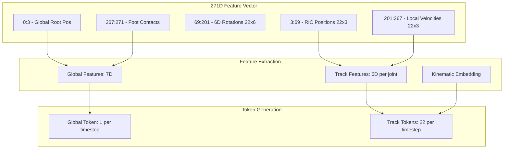

# MotionHistoryEncoder 271D Feature Update Plan

## Overview

Update the `MotionHistoryEncoder` class in `src/models.py` to accept the 271D custom feature vector format from `src/utils/motion_utils.py` instead of the current 263D MoMask format.

## Feature Format Comparison

### Current 263D Format (MoMask/HumanML3D original)

| Component | Indices | Dimension | Description |
|-----------|---------|-----------|-------------|
| Root rotation velocity | 0:4 | 4D | Angular velocity of root |
| RIC positions (21 joints) | 4:67 | 63D | Relative positions (excludes root) |
| 6D rotations (21 joints) | 67:193 | 126D | 6D rotation representation |
| Velocities (22 joints) | 193:259 | 66D | Linear velocities |
| Linear vel + foot contacts | 259:263 | 4D | Root velocity and contact flags |
| **Total** | | **263D** | |

### New 271D Format (from motion_utils.py)

| Component | Indices | Dimension | Description |
|-----------|---------|-----------|-------------|
| Global root position | 0:3 | 3D | Absolute XYZ in world frame |
| RIC positions (22 joints) | 3:69 | 66D | Local positions relative to root |
| 6D rotations (22 joints) | 69:201 | 132D | Auxiliary features from IK |
| Local velocities (22 joints) | 201:267 | 66D | Causal velocities (current - previous) |
| Foot contacts | 267:271 | 4D | Binary contact flags |
| **Total** | | **271D** | |

## Key Differences

1. **Root representation**: New format includes global root position (3D), old format uses root rotation velocity (4D)
2. **RIC positions**: New format includes all 22 joints (66D), old format excludes root (63D)
3. **Rotations**: New format includes all 22 joints (132D), old format excludes root (126D)
4. **Velocity indices**: Different positions in the feature vector
5. **Foot contacts**: Same dimension (4D) but at different indices

## Required Changes

### 1. Update `MotionHistoryEncoder.__init__()` 

**File**: `src/models.py`, lines 41-155

Changes:
- Update `frame_feature_dim` default to 271
- Update `null_history` parameter dimension from 263 to 271
- Update global feature extraction indices
- Update track feature extraction indices

```python
# Current global feature extraction (8D):
# root_rot_vel(4) + lin_vel(3) + foot_contacts(4) = 8D from indices [0:4, 259:263]

# New global feature extraction:
# Option A: Use root position (3D) + foot contacts (4D) = 7D
# Option B: Add root velocity computed from consecutive frames
```

### 2. Update `forward()` Method

**File**: `src/models.py`, lines 189-375

Changes needed for feature extraction:

```python
# OLD (263D):
global_features = torch.cat([
    input_features[:, :, 0:4],      # root rotation velocity
    input_features[:, :, 259:263],  # linear velocity + foot contacts
], dim=-1)  # (B, T_hist, 8)

ric_joints = input_features[:, :, 4:67]   # 21 joints, 63D
ric_vel = input_features[:, :, 193:259]   # 22 joints, 66D

# NEW (271D):
# Global features: root_pos(3) + foot_contacts(4) = 7D
global_features = torch.cat([
    input_features[:, :, 0:3],       # global root position
    input_features[:, :, 267:271],   # foot contacts
], dim=-1)  # (B, T_hist, 7)

# RIC positions: all 22 joints, 66D
ric_joints = input_features[:, :, 3:69]    # 22 joints, 66D
ric_joints = ric_joints.view(B, T_hist, 22, 3)  # No need to add root

# Local velocities: 22 joints, 66D
ric_vel = input_features[:, :, 201:267]    # 22 joints, 66D
ric_vel = ric_vel.view(B, T_hist, 22, 3)
```

### 3. Update `generate_sequence()` in HumanMotionGenerator

**File**: `src/models.py`, lines 623-768

Changes:
- Update history initialization to use 271D
- Update prev_frame_features extraction indices

```python
# OLD:
ric_pos_21 = last_frame[:, 4:67].reshape(B, 21, 3)
prev_rot6d = last_frame[:, 67:193].reshape(B, 21, 6)
prev_v = last_frame[:, 193:259].reshape(B, 22, 3)

# NEW:
ric_pos_22 = last_frame[:, 3:69].reshape(B, 22, 3)    # All 22 joints
prev_rot6d = last_frame[:, 69:201].reshape(B, 22, 6)  # All 22 joints
prev_v = last_frame[:, 201:267].reshape(B, 22, 3)     # All 22 joints
```

### 4. Update Config Class

**File**: `src/config.py`

Changes:
- Update `motion_dim` from 263 to 271

### 5. Update Documentation

**File**: `docs/reference.md`

Update the feature_slices and model input documentation.

## Implementation Steps

1. **Update `src/config.py`**: Change `motion_dim = 263` to `motion_dim = 271`

2. **Update `src/models.py`**:
   - Update `MotionHistoryEncoder.__init__()`:
     - Change `null_history` dimension to 271
     - Update `global_feature_dim` from 8 to 7 (or compute root velocity)
   - Update `forward()`:
     - Update global feature extraction indices
     - Update RIC position extraction (now includes root)
     - Update velocity extraction indices
   - Update `generate_sequence()`:
     - Update prev_frame_features extraction

3. **Update `docs/reference.md`**: Document new feature layout

4. **Update tests**: Ensure test cases use 271D features

## Global Feature Design Decision

**SELECTED: Option C (16D global features)**

The 16D global features provide complete global motion information:

```python
# Compute root velocity from consecutive frames
root_pos = input_features[:, :, 0:3]  # (B, T, 3)
root_vel = torch.zeros_like(root_pos)
root_vel[:, 1:] = root_pos[:, 1:] - root_pos[:, :-1]

global_features = torch.cat([
    root_pos,                        # (B, T, 3) - global root position
    root_vel,                        # (B, T, 3) - computed root velocity
    input_features[:, :, 69:75],     # (B, T, 6) - root 6D rotation
    input_features[:, :, 267:271],   # (B, T, 4) - foot contacts
], dim=-1)  # 16D
```

Update `global_feature_dim = 16` and `global_proj = nn.Linear(16, model_dim)`

## Testing Strategy

1. Unit test for feature extraction with known 271D input
2. Integration test with `IncrementalFeatureExtractor` output
3. Verify round-trip: `preprocess_sequence()` → `MotionHistoryEncoder.forward()` → valid output

## Backward Compatibility

This is a breaking change. Models trained with 263D features will not be compatible with the new 271D format. Consider:
- Version checking in `load_from_checkpoint()`
- Clear documentation of the format change
- Possibly maintaining both formats with a flag

## Mermaid Diagram: Feature Extraction Flow


