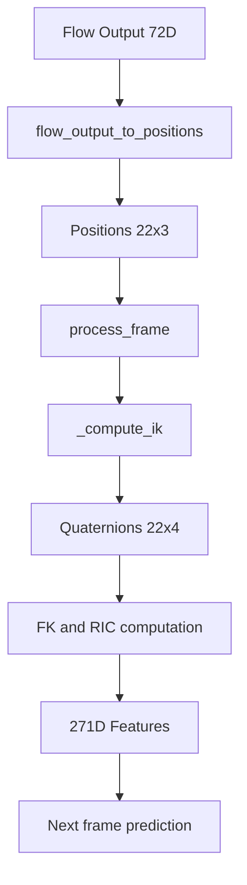

# Fix NaN Values in HumanMotionGenerator.generate_sequence()

## Problem Analysis

The `HumanMotionGenerator.generate_sequence()` method produces NaN values during autoregressive motion generation. The issue has **two root causes**:

### Root Cause 1: Division by Zero in `cont6d_to_matrix`

When `input_features` is None, `null_history` (all zeros) is used. This causes:
1. `features_to_positions(init_frame)` is called on zeros
2. `rotations_6d[..., 0, :]` extracts zeros for root rotation
3. `cont6d_to_quaternion` calls `cont6d_to_matrix` on zeros
4. Line 342: `x = x_raw / torch.norm(x_raw, dim=-1, keepdim=True)` - **NO EPSILON**
5. Division by zero produces NaN

### Root Cause 2: Incorrect Input Handling

Line 796: `history = input_features.unsqueeze(1)` assumes `input_features` is (B, 271), but it could be (B, N, 271) for multi-frame initialization.

### Current Flow



### Identified NaN Sources

1. **`_qbetween` function** - Line 221: `w = 1.0 + dot`
   - When vectors are nearly opposite, `dot ≈ -1`, causing `w ≈ 0`
   - This leads to numerical instability in quaternion normalization

2. **`_compute_ik` function** - Line 186-187: Bone direction normalization
   - When parent-child joints are at the same position, `v` becomes zero
   - Division by near-zero norm produces NaN

3. **`cont6d_to_matrix` function** - Lines 342-344:
   - `x = x_raw / torch.norm(x_raw, dim=-1, keepdim=True)` - No epsilon!
   - If `x_raw` is zero, this produces NaN

4. **`process_frame` RIC computation** - Line 704:
   - `ric = qrot(root_quat, ric)` - Depends on valid quaternions
   - If root_quat contains NaN, it propagates

## Root Cause

The flow predictor outputs may contain:
1. **Invalid 6D rotations** - Not on the 6D rotation manifold
2. **Extreme RIC values** - Leading to degenerate joint positions
3. **Uninitialized null history** - Starting from zeros causes cascading NaN

## Proposed Fix

### Strategy: Add Numerical Safeguards

Add epsilon guards and value clamping throughout the pipeline to prevent NaN propagation:

### 1. Fix `cont6d_to_matrix` in `quaternion.py`

```python
def cont6d_to_matrix(cont6d):
    assert cont6d.shape[-1] == 6, "The last dimension must be 6"
    x_raw = cont6d[..., 0:3]
    y_raw = cont6d[..., 3:6]

    # Add epsilon to prevent division by zero
    x = x_raw / (torch.norm(x_raw, dim=-1, keepdim=True) + 1e-8)
    z = torch.cross(x, y_raw, dim=-1)
    z = z / (torch.norm(z, dim=-1, keepdim=True) + 1e-8)

    y = torch.cross(z, x, dim=-1)

    x = x[..., None]
    y = y[..., None]
    z = z[..., None]

    mat = torch.cat([x, y, z], dim=-1)
    return mat
```

### 2. Fix `_qbetween` in `motion_utils.py`

```python
def _qbetween(v0: torch.Tensor, v1: torch.Tensor) -> torch.Tensor:
    # Normalize with epsilon
    v0 = v0 / (torch.norm(v0, dim=-1, keepdim=True) + 1e-8)
    v1 = v1 / (torch.norm(v1, dim=-1, keepdim=True) + 1e-8)

    dot = (v0 * v1).sum(dim=-1, keepdim=True)

    # Clamp dot product to avoid numerical issues with parallel vectors
    dot = torch.clamp(dot, -0.9999, 0.9999)

    cross = torch.cross(v0, v1, dim=-1)
    w = 1.0 + dot

    q = torch.cat([w, cross], dim=-1)
    q = q / (torch.norm(q, dim=-1, keepdim=True) + 1e-8)

    return q
```

### 3. Fix `_compute_ik` in `motion_utils.py`

```python
def _compute_ik(...):
    # ... existing code ...
    
    for chain in kinematic_chain:
        R = root_quat
        for i in range(len(chain) - 1):
            parent_idx = chain[i]
            child_idx = chain[i + 1]

            u = offsets[:, child_idx]

            v = positions_flat[:, child_idx] - positions_flat[:, parent_idx]
            v_norm = torch.norm(v, dim=-1, keepdim=True)
            
            # Skip if bone direction is too small
            if v_norm.min() < 1e-6:
                v = v / (v_norm + 1e-8)
            else:
                v = v / (v_norm + 1e-8)

            rot_u_v = _qbetween(u, v)
            R_loc = qmul(qinv(R), rot_u_v)

            quaternions[:, child_idx] = R_loc
            R = qmul(R, R_loc)

    return quaternions
```

### 4. Add NaN Detection and Handling in `process_frame`

```python
def process_frame(self, positions: torch.Tensor) -> torch.Tensor:
    # ... existing code ...
    
    # Check for NaN in positions
    if torch.isnan(positions).any():
        # Replace NaN with previous positions
        positions = torch.where(torch.isnan(positions), self.prev_positions, positions)
    
    # ... IK computation ...
    
    # Check for NaN in quaternions
    if torch.isnan(quaternions).any():
        # Use identity quaternions as fallback
        quaternions = torch.zeros_like(quaternions)
        quaternions[:, :, 0] = 1.0  # Identity quaternion
    
    # ... rest of processing ...
```

### 5. Initialize with Valid Starting Pose

In `HumanMotionGenerator.generate_sequence()`, initialize with a valid T-pose instead of null history:

```python
# Initialize with T-pose instead of null history
if input_features is None:
    # Create a valid initial pose
    init_positions = self._get_default_pose()  # Returns (B, 22, 3)
    init_features = preprocess_sequence(init_positions, dataset_type=dataset_type)
    history = init_features.unsqueeze(1)
else:
    # Handle both (B, 271) and (B, N, 271) input shapes
    if input_features.ndim == 2:
        history = input_features.unsqueeze(1)  # (B, 1, 271)
    else:
        history = input_features  # (B, N, 271) already
```

## Test Plan

Create a test file `tests/test_nan_fix.py` that:

1. Loads the checkpoint from `tests/checkpoints/best.pt`
2. Loads input features from `sample_data/000070_vec.npy`
3. Runs `generate_sequence()` for multiple frames
4. Verifies:
   - No NaN values in output positions
   - Output positions are within reasonable bounds
   - Compare against `sample_data/000070_joint.npy` for reference

### Test File Content

```python
"""
Test for NaN values fix in HumanMotionGenerator.generate_sequence().

Uses tests/checkpoints/best.pt and sample_data/000070_vec.npy to verify
the output matches sample_data/000070_joint.npy.
"""

import sys
import os

sys.path.insert(0, os.path.dirname(os.path.dirname(os.path.abspath(__file__))))
sys.path.insert(
    0, os.path.join(os.path.dirname(os.path.dirname(os.path.abspath(__file__))), "src")
)

import torch
import numpy as np


def test_nan_fix():
    """Test that generate_sequence produces valid output without NaN."""
    print("=" * 60)
    print("NaN Fix Test")
    print("=" * 60)

    device = torch.device("cpu")

    # Load sample data
    vecs = np.load("sample_data/000070_vec.npy")
    joints = np.load("sample_data/000070_joint.npy")

    print(f"\nSample data:")
    print(f"  vecs shape: {vecs.shape}")
    print(f"  joints shape: {joints.shape}")

    # Load checkpoint
    from src.models import HumanMotionGenerator
    from src.config import Config

    config = Config()
    generator = HumanMotionGenerator.load_from_checkpoint(
        "tests/checkpoints/best.pt", config, device=str(device)
    )
    generator.eval()

    # Use first frame as input
    input_features = torch.from_numpy(vecs[0]).float()

    # Generate sequence
    with torch.no_grad():
        joint_positions = generator.generate_sequence(
            text="a person walks",
            num_frames=10,
            num_steps=10,
            guidance_scale=2.5,
            input_features=input_features,
            dataset_type="t2m",
        )

    print(f"\nGenerated output:")
    print(f"  joint_positions shape: {joint_positions.shape}")
    print(f"  NaN values: {torch.isnan(joint_positions).any()}")

    assert not torch.isnan(joint_positions).any(), "Output contains NaN values!"

    print(f"  min: {joint_positions.min().item():.6f}")
    print(f"  max: {joint_positions.max().item():.6f}")

    print("\n[PASS] No NaN values in output!")


if __name__ == "__main__":
    test_nan_fix()
```

## Implementation Steps

### Phase 1: Create Debug Test

1. [ ] Create `tests/test_nan_debug.py` to trace NaN propagation step by step
2. [ ] Run debug test to identify exact NaN source

### Phase 2: Critical Fixes

3. [ ] **Fix `cont6d_to_matrix` in `quaternion.py`** - Add epsilon guard to prevent division by zero
4. [ ] **Fix input_features handling in `models.py`** - Handle both (B, 271) and (B, N, 271) input shapes
5. [ ] **Initialize with valid T-pose** - Replace null_history zeros with valid initial pose

### Phase 3: Additional Safeguards (if needed)

6. [ ] Add dot product clamping to `_qbetween` in `motion_utils.py`
7. [ ] Add bone direction validation in `_compute_ik` in `motion_utils.py`
8. [ ] Add NaN detection in `process_frame` in `motion_utils.py`

### Phase 4: Final Verification

9. [ ] Create test file `tests/test_nan_fix.py`
10. [ ] Run test and verify NaN is fixed

## Iterative Debugging Approach

Since NaN values appear even with valid input_features, we need to trace through the code step by step:

1. **Test individual components first:**
   - `features_to_positions()` on sample data
   - `extract_prev_frame_features()` on sample data
   - `flow_output_to_positions()` on sample data
   - `IncrementalFeatureExtractor.process_frame()` on sample data

2. **Test the full pipeline:**
   - Load checkpoint and run `generate_sequence()`
   - Add print statements to trace NaN propagation

3. **Fix issues iteratively:**
   - Apply one fix at a time
   - Re-run test after each fix
   - Verify NaN is resolved
