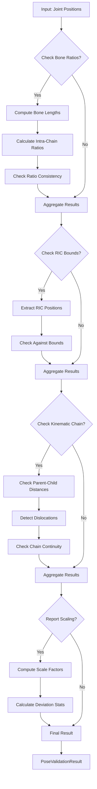

# Pose Validation Plan for HumanMotionGenerator

## Overview

This plan outlines the implementation of a comprehensive pose validation system to check if generated motions from `HumanMotionGenerator` conform to the skeleton structure using RIC (Root-Invariant Coordinates) positions.

## Background

### Skeleton Structure (T2M)

The HumanML3D dataset uses a 22-joint skeleton with the following structure:

```
Joint Indices:
0: Root (pelvis)
1: Right Hip, 4: Right Knee, 7: Right Ankle, 10: Right Foot
2: Left Hip, 5: Left Knee, 8: Left Ankle, 11: Left Foot
3: Spine, 6: Spine1, 9: Spine2 (chest), 12: Neck, 15: Head
13: Right Shoulder, 16: Right Elbow, 18: Right Wrist, 20: Right Hand
14: Left Shoulder, 17: Left Elbow, 19: Left Wrist, 21: Left Hand
```

### Kinematic Chains

```python
T2M_KINEMATIC_CHAIN = [
    [0, 2, 5, 8, 11],        # Left leg
    [0, 1, 4, 7, 10],        # Right leg
    [0, 3, 6, 9, 12, 15],    # Spine
    [9, 14, 17, 19, 21],     # Right arm
    [9, 13, 16, 18, 20],     # Left arm
]
```

### T2M_RAW_OFFSETS (Bone Vectors in T-Pose)

Each offset represents the direction and relative length from parent to child:
```python
T2M_RAW_OFFSETS = [
    [0, 0, 0],    # 0: Root (no parent)
    [1, 0, 0],    # 1: Right Hip (X direction)
    [-1, 0, 0],   # 2: Left Hip (-X direction)
    [0, 1, 0],    # 3: Spine (Y direction)
    [0, -1, 0],   # 4: Right Knee
    [0, -1, 0],   # 5: Left Knee
    [0, 1, 0],    # 6: Spine1
    [0, -1, 0],   # 7: Right Ankle
    [0, -1, 0],   # 8: Left Ankle
    [0, 1, 0],    # 9: Spine2 (chest)
    [0, 0, 1],    # 10: Right Foot
    [0, 0, 1],    # 11: Left Foot
    [0, 1, 0],    # 12: Neck
    [1, 0, 0],    # 13: Right Shoulder
    [-1, 0, 0],   # 14: Left Shoulder
    [0, 0, 1],    # 15: Head
    [0, -1, 0],   # 16: Right Elbow
    [0, -1, 0],   # 17: Left Elbow
    [0, -1, 0],   # 18: Right Wrist
    [0, -1, 0],   # 19: Left Wrist
    [0, -1, 0],   # 20: Right Hand
    [0, -1, 0],   # 21: Left Hand
]
```

## Validation Components

### 1. Bone Length Ratio Validation

**Purpose**: Check if bone length ratios within a pose are consistent, handling potential scaling issues.

**Approach**:
- Compute actual bone lengths for each parent-child pair in the kinematic chain
- Calculate expected ratios from T2M_RAW_OFFSETS
- Compare actual ratios vs expected ratios

**Expected Ratios** (from T2M_RAW_OFFSETS magnitudes):
- Hip bones (joints 1,2): length 1.0
- Leg segments (joints 4,5,7,8): length 1.0 each
- Spine segments (joints 3,6,9,12): length 1.0 each
- Arm segments (joints 16,17,18,19,20,21): length 1.0 each
- Feet (joints 10,11): length 1.0
- Shoulders (joints 13,14): length 1.0
- Head (joint 15): length 1.0

**Validation Logic**:
```python
def validate_bone_length_ratios(positions, tolerance=0.5):
    # positions: (B, 22, 3) or (N, 22, 3)
    
    # Compute bone lengths for each chain
    bone_lengths = {}
    for chain in T2M_KINEMATIC_CHAIN:
        for i in range(len(chain) - 1):
            parent = chain[i]
            child = chain[i+1]
            bone_name = f"{parent}_{child}"
            length = torch.norm(positions[..., child, :] - positions[..., parent, :], dim=-1)
            bone_lengths[bone_name] = length
    
    # Compute ratios within each chain
    # E.g., thigh_length / shin_length should be consistent
    ratios = compute_intra_chain_ratios(bone_lengths)
    
    # Check if ratios are consistent (low variance)
    # Allow tolerance for natural variation
    return validate_ratios(ratios, tolerance)
```

### 2. RIC Position Bounds Checking

**Purpose**: Validate that RIC positions fall within anatomically plausible ranges.

**RIC Position Definition**:
- RIC = Root-Invariant Coordinates
- Local positions relative to root joint, rotated to root-local frame
- Located at features[3:69] in 271D format (22 joints × 3D)

**Expected Bounds** (approximate, based on human anatomy):
- Root (joint 0): [0, 0, 0] (by definition)
- Hips (joints 1,2): X within ±0.3, Y within ±0.1, Z within ±0.15
- Legs: Progressive extension down, max reach ~1.0 from root
- Spine: Y increasing upward, max ~0.8
- Arms: Max reach ~1.5 from root when extended

**Validation Logic**:
```python
def validate_ric_bounds(ric_positions, bounds=None):
    # ric_positions: (..., 22, 3)
    
    if bounds is None:
        bounds = get_default_ric_bounds()
    
    violations = {}
    for joint_idx in range(22):
        joint_ric = ric_positions[..., joint_idx, :]
        joint_bounds = bounds[joint_idx]
        
        # Check each dimension
        for dim in range(3):
            min_val, max_val = joint_bounds[dim]
            out_of_bounds = (joint_ric[..., dim] < min_val) | (joint_ric[..., dim] > max_val)
            if out_of_bounds.any():
                violations[f"joint_{joint_idx}_dim_{dim}"] = out_of_bounds
    
    return violations
```

### 3. Kinematic Chain Validity

**Purpose**: Ensure joint positions respect the skeleton hierarchy.

**Checks**:
1. **Connectivity**: Child joints should be within expected distance from parent
2. **No joint dislocation**: Distance between parent-child should not exceed bone length × tolerance
3. **Chain continuity**: No sudden jumps in bone lengths within a chain

**Validation Logic**:
```python
def validate_kinematic_chain(positions, tolerance=2.0):
    # positions: (..., 22, 3)
    
    issues = []
    
    for chain in T2M_KINEMATIC_CHAIN:
        chain_lengths = []
        for i in range(len(chain) - 1):
            parent = chain[i]
            child = chain[i+1]
            
            # Compute actual distance
            actual_dist = torch.norm(
                positions[..., child, :] - positions[..., parent, :], dim=-1
            )
            chain_lengths.append(actual_dist)
            
            # Check for dislocation (distance too large)
            expected_length = torch.norm(T2M_RAW_OFFSETS[child])
            if expected_length > 0:
                max_allowed = expected_length * tolerance
                dislocated = actual_dist > max_allowed
                if dislocated.any():
                    issues.append({
                        "type": "potential_dislocation",
                        "parent": parent,
                        "child": child,
                        "actual_distance": actual_dist,
                        "max_allowed": max_allowed,
                    })
        
        # Check chain continuity (no sudden length changes)
        if len(chain_lengths) > 1:
            for i in range(len(chain_lengths) - 1):
                ratio = chain_lengths[i] / (chain_lengths[i+1] + 1e-8)
                unusual_ratio = (ratio < 0.3) | (ratio > 3.0)
                if unusual_ratio.any():
                    issues.append({
                        "type": "unusual_bone_ratio",
                        "chain": chain,
                        "ratio": ratio,
                    })
    
    return issues
```

### 4. Scaling Deviation Reporting

**Purpose**: Report how much the generated pose deviates from expected proportions.

**Metrics**:
- Average bone length
- Bone length standard deviation
- Scale factor estimation (comparing to T2M_RAW_OFFSETS)

**Reporting Logic**:
```python
def compute_scaling_metrics(positions):
    # positions: (..., 22, 3)
    
    bone_lengths = compute_all_bone_lengths(positions)
    expected_lengths = compute_expected_bone_lengths()
    
    # Compute scale factor
    scale_factors = []
    for bone_name, actual in bone_lengths.items():
        expected = expected_lengths.get(bone_name, 1.0)
        if expected > 0:
            scale_factors.append(actual / expected)
    
    metrics = {
        "mean_scale": torch.mean(torch.stack(scale_factors)),
        "std_scale": torch.std(torch.stack(scale_factors)),
        "min_scale": torch.min(torch.stack(scale_factors)),
        "max_scale": torch.max(torch.stack(scale_factors)),
        "bone_lengths": bone_lengths,
    }
    
    return metrics
```

## API Design

### Main Validation Function

```python
def validate_pose(
    positions: torch.Tensor,
    check_bone_ratios: bool = True,
    check_ric_bounds: bool = True,
    check_kinematic_chain: bool = True,
    report_scaling: bool = True,
    bone_ratio_tolerance: float = 0.5,
    dislocation_tolerance: float = 2.0,
) -> PoseValidationResult:
    """
    Comprehensive pose validation for generated motion.
    
    Args:
        positions: Joint positions (B, 22, 3) or (N, 22, 3)
        check_bone_ratios: Whether to validate bone length ratios
        check_ric_bounds: Whether to validate RIC position bounds
        check_kinematic_chain: Whether to validate kinematic chain
        report_scaling: Whether to compute scaling metrics
        bone_ratio_tolerance: Tolerance for bone ratio variance
        dislocation_tolerance: Max allowed ratio of actual/expected bone length
    
    Returns:
        PoseValidationResult with validation status and details
    """
```

### Result Dataclass

```python
@dataclass
class PoseValidationResult:
    is_valid: bool
    bone_ratio_issues: List[Dict]
    ric_bound_violations: Dict
    kinematic_issues: List[Dict]
    scaling_metrics: Dict
    
    def summary(self) -> str:
        """Return human-readable summary."""
        pass
    
    def to_dict(self) -> Dict:
        """Convert to dictionary for logging."""
        pass
```

## Implementation Plan

### File Structure

```
src/utils/
    motion_utils.py       # Add validation functions here
    # OR
    pose_validation.py    # New dedicated module

tests/
    test_pose_validation.py  # Unit tests
```

### Implementation Steps

1. **Create `PoseValidationResult` dataclass**
   - Define result structure
   - Add summary and serialization methods

2. **Implement bone length computation helper**
   - Extract bone lengths from positions
   - Compute ratios within chains

3. **Implement bone ratio validation**
   - Compare ratios within each chain
   - Flag unusual ratios

4. **Implement RIC bounds validation**
   - Define default bounds per joint
   - Check positions against bounds

5. **Implement kinematic chain validation**
   - Check parent-child distances
   - Detect dislocations
   - Check chain continuity

6. **Implement scaling metrics**
   - Compute scale factors
   - Report deviation statistics

7. **Create main `validate_pose` function**
   - Combine all validation components
   - Return comprehensive result

8. **Add unit tests**
   - Test with valid poses from sample data
   - Test with artificially corrupted poses
   - Test edge cases

## Testing Strategy

### Test Cases

1. **Valid pose from dataset**: Should pass all validations
2. **Scaled pose**: Should pass ratio checks but report scaling deviation
3. **Corrupted pose with dislocation**: Should fail kinematic chain check
4. **Pose with extreme RIC values**: Should fail RIC bounds check
5. **Generated motion sequence**: Validate each frame

### Test Data

- Use `sample_data/000070_joint.npy` for valid poses
- Create synthetic corrupted poses for failure cases

## Usage Example

```python
from src.utils.pose_validation import validate_pose

# Generate motion
generator = HumanMotionGenerator.load_from_checkpoint(...)
joints = generator.generate_sequence("a person walks", num_frames=100)

# Validate each frame
for frame_idx in range(joints.shape[1]):
    frame = joints[:, frame_idx, :, :]  # (B, 22, 3)
    result = validate_pose(frame)
    
    if not result.is_valid:
        print(f"Frame {frame_idx}: {result.summary()}")

# Or validate entire sequence
results = validate_pose_sequence(joints)
```

## Mermaid Diagram: Validation Flow



## Next Steps

1. Switch to Code mode to implement the validation module
2. Create the `PoseValidationResult` dataclass
3. Implement each validation component
4. Add unit tests
5. Update documentation
