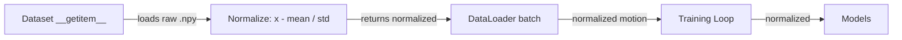
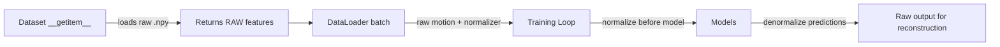
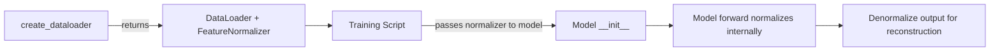

# Raw Feature Vectors Refactoring Plan

## Overview

Currently, the `Text2MotionDataset` normalizes motion features in `__getitem__` before returning them. The goal is to return **raw (unnormalized) features** from the dataset and handle normalization/denormalization externally using the existing `FeatureNormalizer` class.

## Current Flow



## Proposed Flow



## Changes Required

### 1. `src/utils/dataset.py` - Text2MotionDataset

**Changes:**
- Remove normalization in `__getitem__` (line 221)
- Keep `mean` and `std` stored but do not use them for normalization
- Add `get_normalizer()` method to return a `FeatureNormalizer` instance
- Remove `inv_transform` method (no longer needed)

**Before:**
```python
# ===== NORMALIZE =====
motion = (motion - self.mean) / self.std
```

**After:**
```python
# No normalization - return raw features
# Normalization handled externally via FeatureNormalizer
```

### 2. `src/utils/dataset.py` - create_dataloader

**Changes:**
- Return both the DataLoader AND a `FeatureNormalizer` instance

**Proposed signature:**
```python
def create_dataloader(
    config: Config,
    split: str = "train",
    shuffle: bool = True,
) -> Tuple[DataLoader, FeatureNormalizer]:
    ...
    normalizer = FeatureNormalizer(
        mean=torch.from_numpy(mean).float(),
        std=torch.from_numpy(std).float()
    )
    return dataloader, normalizer
```

### 3. `src/models.py` - MotionHistoryEncoder

**Changes:**
- Add `normalizer` parameter to `__init__`
- Normalize `input_features` in `forward()` before processing

**Before:**
```python
def forward(self, text, input_features, batch_size):
    # input_features is already normalized
    ...
```

**After:**
```python
def __init__(self, ..., normalizer: Optional[FeatureNormalizer] = None):
    self.normalizer = normalizer
    ...

def forward(self, text, input_features, batch_size):
    # Normalize raw features
    if self.normalizer is not None:
        input_features = self.normalizer.normalize(input_features)
    ...
```

### 4. `src/models.py` - FlowMatchingPredictor

**Changes:**
- Add `normalizer` parameter to `__init__`
- Normalize `prev_frame_features` and `noisy_target` in `forward()` before processing
- **Note**: The noisy_target is derived from clean_target which needs normalization

**Before:**
```python
def forward(self, history_features, noise_level, noisy_target, prev_frame_features, ...):
    # All inputs already normalized
    ...
```

**After:**
```python
def __init__(self, ..., normalizer: Optional[FeatureNormalizer] = None):
    self.normalizer = normalizer
    ...

def forward(self, history_features, noise_level, noisy_target, prev_frame_features, ...):
    # Normalize raw features
    if self.normalizer is not None:
        # prev_frame_features is 261D - need to handle specially
        # noisy_target is 72D - need to handle specially
        ...
```

**Important consideration**: The `prev_frame_features` (261D) and `noisy_target` (72D) are subsets of the full 271D features. We need helper methods to normalize these subsets.

### 5. `src/utils/motion_utils.py` - FeatureNormalizer Extensions

**Add methods for 261D and 72D normalization:**
```python
def normalize_prev_frame_features(self, features: torch.Tensor) -> torch.Tensor:
    """Normalize 261D prev_frame_features."""
    # Extract relevant indices from mean/std for 261D
    
def normalize_clean_target(self, target: torch.Tensor) -> torch.Tensor:
    """Normalize 72D clean_target."""
    # Extract relevant indices from mean/std for 72D
```

### 6. `src/utils/train_utils.py` - Training Loop

**Changes:**
- Pass normalizer to models during initialization
- No changes needed in training loop itself (models handle normalization)

**Before:**
```python
encoder = MotionHistoryEncoder(...)
predictor = FlowMatchingPredictor(...)
```

**After:**
```python
encoder = MotionHistoryEncoder(..., normalizer=normalizer)
predictor = FlowMatchingPredictor(..., normalizer=normalizer)
```

### 7. `src/models.py` - HumanMotionGenerator

**Changes:**
- Accept `FeatureNormalizer` in `__init__`
- Pass to encoder and predictor
- Normalize input features before encoding
- Denormalize output features for reconstruction

### 5. Inference Pipeline

**Changes:**
- Ensure `sequence_joints_to_features` produces raw features
- Normalize before passing to encoder
- Denormalize flow output before reconstruction

## Implementation Order

1. **Phase 1: FeatureNormalizer Extensions** (`src/utils/motion_utils.py`)
   - Add `normalize_prev_frame_features()` for 261D
   - Add `normalize_clean_target()` for 72D
   - Add corresponding denormalize methods if needed

2. **Phase 2: Dataset Changes** (`src/utils/dataset.py`)
   - Modify `Text2MotionDataset.__getitem__` to return raw features
   - Remove `inv_transform` method (no longer needed)
   - Update `create_dataloader` to return `(DataLoader, FeatureNormalizer)` tuple

3. **Phase 3: Model Changes** (`src/models.py`)
   - Add `normalizer` parameter to `MotionHistoryEncoder.__init__`
   - Add normalization in `MotionHistoryEncoder.forward()`
   - Add `normalizer` parameter to `FlowMatchingPredictor.__init__`
   - Add normalization in `FlowMatchingPredictor.forward()`
   - Update `HumanMotionGenerator` to accept and use normalizer

4. **Phase 4: Training Changes** (`src/utils/train_utils.py`)
   - Update `train()` to unpack normalizer from `create_dataloader()`
   - Pass normalizer to model constructors

5. **Phase 5: Testing & Documentation**
   - Update existing tests
   - Add tests for normalization/denormalization roundtrip
   - Update `docs/reference.md`

## API Changes Summary

| Component | Before | After |
|-----------|--------|-------|
| `dataset[i]` | normalized motion | raw motion |
| `create_dataloader()` | returns DataLoader | returns (DataLoader, FeatureNormalizer) |
| `MotionHistoryEncoder.__init__` | no normalizer | accepts normalizer param |
| `FlowMatchingPredictor.__init__` | no normalizer | accepts normalizer param |
| `HumanMotionGenerator.__init__` | no normalizer | accepts normalizer param |
| Model `forward()` | expects normalized | normalizes internally |

## Benefits

1. **Flexibility**: Normalization can be changed without modifying dataset
2. **Debugging**: Easy to inspect raw features
3. **Consistency**: Single `FeatureNormalizer` class for all normalization logic
4. **Reconstruction**: Direct access to raw features for position reconstruction

## Risks & Mitigations

| Risk | Mitigation |
|------|------------|
| Breaking existing code | Update all callers in same PR |
| Forgetting to normalize somewhere | Add assertions for value ranges |
| Performance impact | Normalization is cheap, negligible overhead |

## Design Decisions (Confirmed)

1. **Dataloader returns tuple**: `create_dataloader()` returns `(DataLoader, FeatureNormalizer)`
2. **Normalize inside model forward()**: Models accept raw features and normalize internally
3. **Normalizer passed to model `__init__`**: Models store normalizer as attribute

## Updated Flow with Design Decisions

