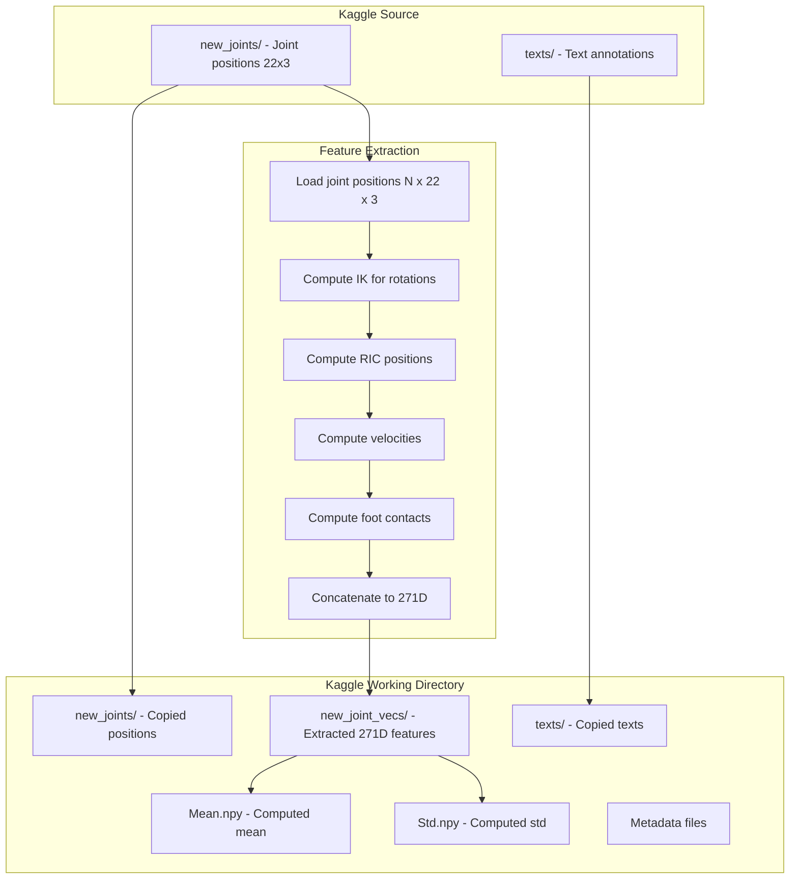

# HumanML3D Subset Generator Modification Plan

## Overview

Modify `misc/humanml3d-subset-generator.ipynb` to:
1. Use `new_joints/` directory for frame validation instead of `new_joint_vecs/`
2. Extract 271D features from joint positions using `preprocess_sequence()` from `motion_utils.py`
3. Save extracted features to `new_joint_vecs/` in the target directory

## Current Behavior Analysis

### Current Flow:
```
1. check_file() reads from new_joint_vecs/ to validate frame count
2. List files from new_joint_vecs/ directory
3. Copy files from new_joints/ and texts/ to target
4. Copy Mean.npy and Std.npy from source
```

### Issues:
- `new_joint_vecs/` in source has different feature dimensions (likely 263D from original HumanML3D)
- We need 271D features as defined in our `motion_utils.py`

## Proposed Changes

### 1. Modify `check_file()` Function

**Current code (lines 51-67):**
```python
def check_file(filename):
    path = "/kaggle/input/humanml3d/HumanML3D/humanml/new_joint_vecs/" + filename
    try:
        frames = np.load(path, mmap_mode="r").shape[0]
        if MIN_FRAMES <= frames <= MAX_FRAMES:
            return filename[:-4]
    except:
        return None
```

**New code:**
```python
def check_file(filename):
    path = "/kaggle/input/humanml3d/HumanML3D/humanml/new_joints/" + filename
    try:
        # Read joint positions to check frame count
        data = np.load(path, mmap_mode="r")
        frames = data.shape[0]
        if MIN_FRAMES <= frames <= MAX_FRAMES:
            return filename[:-4]
    except:
        return None
```

### 2. Update File Listing

**Current code (lines 73-81):**
```python
all_files = [
    f
    for f in os.listdir("/kaggle/input/humanml3d/HumanML3D/humanml/new_joint_vecs/")
    if f.endswith(".npy")
]
```

**New code:**
```python
all_files = [
    f
    for f in os.listdir("/kaggle/input/humanml3d/HumanML3D/humanml/new_joints/")
    if f.endswith(".npy")
]
```

### 3. Add 271D Feature Extraction

Add imports and feature extraction function:

```python
import sys
sys.path.append("/kaggle/input/humanml3d/HumanML3D/")  # Add path if motion_utils is available
# OR define the extraction inline

import torch
from typing import List, Dict, Any

# Feature extraction constants
T2M_KINEMATIC_CHAIN = [
    [0, 2, 5, 8, 11],  # Left leg
    [0, 1, 4, 7, 10],  # Right leg
    [0, 3, 6, 9, 12, 15],  # Spine
    [9, 14, 17, 19, 21],  # Right arm
    [9, 13, 16, 18, 20],  # Left arm
]

FACE_JOINT_INDX = [2, 1, 17, 16]  # r_hip, l_hip, sdr_r, sdr_l
FID_R = [8, 11]  # Right foot indices
FID_L = [7, 10]  # Left foot indices
```

### 4. Feature Extraction Function

Add a complete feature extraction function that converts joint positions (N, 22, 3) to 271D features (N, 271):

```python
def extract_271d_features(positions: np.ndarray, feet_thre: float = 0.002) -> np.ndarray:
    """
    Extract 271D features from joint positions.
    
    Args:
        positions: Joint positions (N, 22, 3)
        feet_thre: Foot contact threshold
        
    Returns:
        Feature vectors (N, 271)
    """
    # Implementation using the logic from motion_utils.py preprocess_sequence()
    # ... (full implementation needed)
```

### 5. Update Copy Function

**Current code (lines 147-158):**
```python
def copy_files_for_id(i):
    for sd in subdirs:
        for ext in [".npy", ".txt"]:
            src_file = os.path.join(SOURCE_DIR, sd, f"{i}{ext}")
            if os.path.exists(src_file):
                shutil.copy(src_file, os.path.join(TARGET_DIR, sd, f"{i}{ext}"))
```

**New code:**
```python
subdirs = ["new_joints", "texts", "new_joint_vecs"]

def copy_files_for_id(i):
    # Copy joint positions
    src_joints = os.path.join(SOURCE_DIR, "new_joints", f"{i}.npy")
    if os.path.exists(src_joints):
        # Copy to new_joints
        shutil.copy(src_joints, os.path.join(TARGET_DIR, "new_joints", f"{i}.npy"))
        
        # Extract 271D features and save to new_joint_vecs
        positions = np.load(src_joints)
        features = extract_271d_features(positions)
        np.save(os.path.join(TARGET_DIR, "new_joint_vecs", f"{i}.npy"), features)
    
    # Copy text files
    src_text = os.path.join(SOURCE_DIR, "texts", f"{i}.txt")
    if os.path.exists(src_text):
        shutil.copy(src_text, os.path.join(TARGET_DIR, "texts", f"{i}.txt"))
```

### 6. Compute Mean and Std for 271D Features

Instead of copying Mean.npy and Std.npy from source, compute them from the extracted features:

```python
# Collect all features
all_features = []
for i in tqdm(subset_ids, desc="Loading features for mean/std"):
    feat_path = os.path.join(TARGET_DIR, "new_joint_vecs", f"{i}.npy")
    if os.path.exists(feat_path):
        all_features.append(np.load(feat_path))

# Stack and compute statistics
all_features_stacked = np.concatenate(all_features, axis=0)  # (Total_frames, 271)
mean = all_features_stacked.mean(axis=0)
std = all_features_stacked.std(axis=0)

# Avoid division by zero
std[std == 0] = 1.0

# Save
np.save(os.path.join(TARGET_DIR, "Mean.npy"), mean)
np.save(os.path.join(TARGET_DIR, "Std.npy"), std)

print(f"Mean shape: {mean.shape}, Std shape: {std.shape}")
```

## Implementation Steps

1. **Update `check_file()` function** - Change path from `new_joint_vecs/` to `new_joints/`

2. **Update file listing** - List files from `new_joints/` directory

3. **Add feature extraction code** - Include the full 271D extraction logic from `motion_utils.py`

4. **Update `copy_files_for_id()` function** - Extract features and save to `new_joint_vecs/`

5. **Update Mean/Std computation** - Compute from extracted 271D features

6. **Create target directories** - Add `new_joint_vecs` to subdirs list

## Feature Layout (271D)

| Component | Indices | Dimension | Description |
|-----------|---------|-----------|-------------|
| Global root position | 0:3 | 3D | Absolute XYZ in world frame |
| RIC positions | 3:69 | 66D | 22 joints × 3D local positions |
| 6D rotations | 69:201 | 132D | 22 joints × 6D rotations |
| Local velocities | 201:267 | 66D | 22 joints × 3D velocities |
| Foot contacts | 267:271 | 4D | Binary contact flags |
| **Total** | | **271D** | |

## Mermaid Diagram: New Data Flow



## User Decisions

1. **Feature extraction code**: Include full 271D extraction code inline in the notebook
2. **Validation**: Add round-trip validation to verify features can reconstruct joint positions
3. **Visualization**: Keep the existing visualization code at the end of the notebook

## Final Implementation Checklist

- [ ] Modify `check_file()` to read from `new_joints/`
- [ ] Update file listing to use `new_joints/` directory
- [ ] Add full 271D feature extraction code inline
- [ ] Update `copy_files_for_id()` to extract and save 271D features
- [ ] Add round-trip validation step
- [ ] Compute Mean.npy and Std.npy from extracted features
- [ ] Keep visualization code
