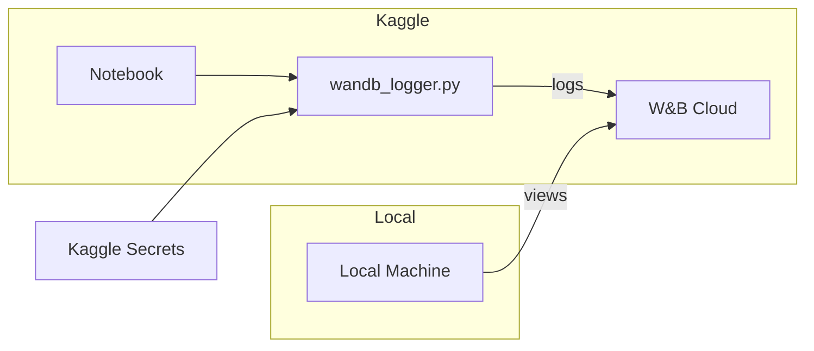

# W&B Integration Plan

## Overview

Create a wandb logging module in `src/utils/wandb_logger.py` that can be used in both local training and Kaggle notebooks for external monitoring.

## Implementation Status

✅ **Completed** - See [`src/utils/wandb_logger.py`](../src/utils/wandb_logger.py) and [`src/utils/train_utils.py`](../src/utils/train_utils.py)

## Architecture



## Files Created/Modified

### 1. New File: `src/utils/wandb_logger.py`

A modular wandb wrapper with:
- `WandbLogger` class for initialization and logging
- Kaggle secret detection and auto-login
- Graceful fallback when wandb is not available
- Context manager support

### 2. Modified: `src/utils/train_utils.py`

Added wandb logging to the `train()` function:
- New parameters: `wandb_project`, `wandb_run_name`
- Logs training metrics: loss, learning rate, epoch
- Logs model checkpoints as artifacts
- Logs training configuration

## Setup Instructions

### Step 1: Get W&B API Key

1. Go to https://wandb.ai/authorize
2. Copy your API key

### Step 2: Add Secret to Kaggle

1. Open your Kaggle notebook
2. Go to **Add-ons** → **Secrets**
3. Click **Add Secret**
4. Name: `WANDB_API_KEY`
5. Value: Paste your API key

### Step 3: Install wandb in Kaggle

Add this to your notebook:
```python
!pip install wandb -q
```

## Usage in Notebook

### Option 1: Using train() function (Recommended)

```python
from utils.train_utils import train

# Training with W&B logging enabled
ema_mhe, ema_fmp = train(
    motion_history_encoder=mhe,
    flow_predictor=fp,
    dataloader=train_loader,
    num_epochs=100,
    save_dir="/kaggle/working/checkpoints",
    device="cuda",
    lr=1e-4,
    wandb_project="motion-generation",      # Enable W&B logging
    # wandb_run_name is auto-generated as "run-YYYY-MM-DD_HH-MM"
)
```

### Option 2: Using WandbLogger directly

```python
from utils.wandb_logger import WandbLogger

# Initialize with auto-generated name (run-YYYY-MM-DD_HH-MM-SS)
logger = WandbLogger(
    project="motion-generation",
    config={
        "lr": 1e-4,
        "epochs": 100,
        "model": "flow_predictor"
    }
)

# Or specify a custom name
logger = WandbLogger(
    project="motion-generation",
    name="my-custom-experiment",
    config={"lr": 1e-4}
)

# In training loop
logger.log({"loss": loss, "lr": lr}, step=global_step)

# Save checkpoint
logger.log_model("checkpoints/best.pt", "best-model")

# Finish
logger.finish()
```

### Option 3: Context Manager

```python
from utils.wandb_logger import WandbLogger

with WandbLogger(project="motion-generation", name="experiment-1") as logger:
    for epoch in range(epochs):
        # ... training ...
        logger.log({"loss": loss}, step=step)
    # Automatically calls logger.finish() on exit
```

## Viewing Results

After starting training on Kaggle:

1. Go to https://wandb.ai
2. Navigate to your project: `motion-generation`
3. Click on your run to see:
   - Real-time loss curves
   - Learning rate schedule
   - Model checkpoints (in Artifacts tab)
   - Training configuration

## Metrics Logged

| Metric | Frequency | Description |
|--------|-----------|-------------|
| `train/loss` | Per batch | Training loss |
| `train/lr` | Per batch | Current learning rate |
| `train/epoch` | Per batch | Current epoch number |
| `train/grad_norm` | Per batch | Gradient norm (before clipping) |
| `train/batch_time` | Per batch | Time per batch (seconds) |
| `train/samples_per_sec` | Per batch | Training throughput |
| `system/gpu_memory_allocated_gb` | Per batch | GPU memory allocated (GB) |
| `system/gpu_memory_reserved_gb` | Per batch | GPU memory reserved (GB) |
| `epoch/avg_loss` | Per epoch | Average epoch loss |
| `epoch/num` | Per epoch | Epoch number |
| `best_loss` | Final | Best loss achieved |

## Artifacts Logged

| Artifact | When | Description |
|----------|------|-------------|
| `best-model-epoch-N` | New best (every 10 epochs) | Best model checkpoint |

Model artifacts are only logged every 10 epochs after a new best to save storage space.

## Benefits

1. **Real-time monitoring** - View training progress from any browser
2. **No code changes** - Same code works locally and on Kaggle
3. **Automatic fallback** - Gracefully handles missing wandb
4. **Artifact tracking** - Model versions saved automatically
5. **Free tier** - Personal projects are free
